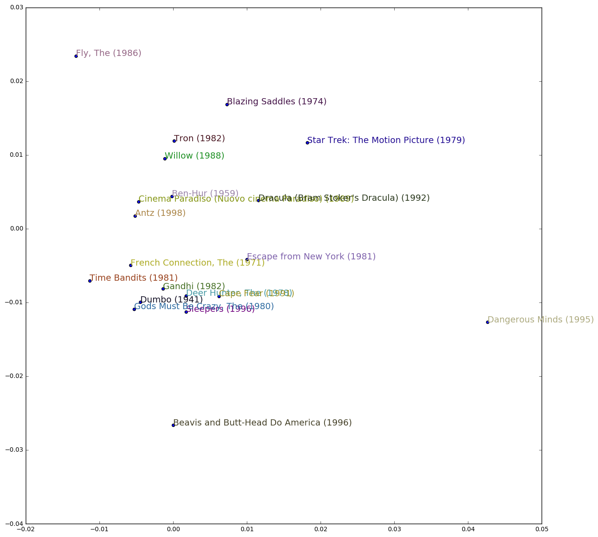

```python
%matplotlib inline
import numpy as np
import pandas as pd
import utils; reload(utils)
from utils import *
```


```python
!echo "PWD: "`pwd`

CUR_DIR=!pwd
CUR_DIR=CUR_DIR[0]
!echo "CUR_DIR:" $CUR_DIR

DATA_DIR="%s/../data/movielens" % CUR_DIR
!echo "DATA_DIR: "$DATA_DIR
```

    PWD: /Applications/GITHub/keras/course_fast_ai/lesson_1
    CUR_DIR: /Applications/GITHub/keras/course_fast_ai/lesson_1
    DATA_DIR: /Applications/GITHub/keras/course_fast_ai/lesson_1/../data/movielens


## One time setup

Create the data directories


```python
!mkdir $DATA_DIR
!mkdir $DATA_DIR/sample
```

    mkdir: cannot create directory ‘/Applications/GITHub/keras/course_fast_ai/lesson_1/../data/movielens’: File exists
    mkdir: cannot create directory ‘/Applications/GITHub/keras/course_fast_ai/lesson_1/../data/movielens/sample’: File exists


Download the 100k sample data(from github mirror since currently the main site is down)


```python
!wget https://raw.githubusercontent.com/nchah/movielens-recommender/master/data/ml-movies.csv -O $DATA_DIR/sample/movies.csv
!wget https://raw.githubusercontent.com/nchah/movielens-recommender/master/data/ml-ratings-100k-sample.csv -O $DATA_DIR/sample/ratings.csv  
```

    --2017-06-06 18:40:59--  https://raw.githubusercontent.com/nchah/movielens-recommender/master/data/ml-movies.csv
    Resolving raw.githubusercontent.com (raw.githubusercontent.com)... 151.101.112.133
    Connecting to raw.githubusercontent.com (raw.githubusercontent.com)|151.101.112.133|:443... connected.
    HTTP request sent, awaiting response... 200 OK
    Length: 1397542 (1,3M) [text/plain]
    Saving to: ‘/Applications/GITHub/keras/course_fast_ai/lesson_1/../data/movielens/sample/movies.csv’
    
    /Applications/GITHu 100%[===================>]   1,33M  3,99MB/s    in 0,3s    
    
    2017-06-06 18:41:01 (3,99 MB/s) - ‘/Applications/GITHub/keras/course_fast_ai/lesson_1/../data/movielens/sample/movies.csv’ saved [1397542/1397542]
    
    --2017-06-06 18:41:01--  https://raw.githubusercontent.com/nchah/movielens-recommender/master/data/ml-ratings-100k-sample.csv
    Resolving raw.githubusercontent.com (raw.githubusercontent.com)... 151.101.112.133
    Connecting to raw.githubusercontent.com (raw.githubusercontent.com)|151.101.112.133|:443... connected.
    HTTP request sent, awaiting response... 200 OK
    Length: 1215898 (1,2M) [text/plain]
    Saving to: ‘/Applications/GITHub/keras/course_fast_ai/lesson_1/../data/movielens/sample/ratings.csv’
    
    /Applications/GITHu 100%[===================>]   1,16M  2,60MB/s    in 0,4s    
    
    2017-06-06 18:41:02 (2,60 MB/s) - ‘/Applications/GITHub/keras/course_fast_ai/lesson_1/../data/movielens/sample/ratings.csv’ saved [1215898/1215898]
    


## Load the model and test it works


```python
DATA = "%s/sample" % DATA_DIR
```


```python
ratings = pd.read_csv(DATA+"/ratings.csv")
ratings.head()
```


<div>
<table border="1" class="dataframe">
  <thead>
    <tr style="text-align: right;">
      <th></th>
      <th>userId</th>
      <th>movieId</th>
      <th>rating</th>
      <th>timestamp</th>
    </tr>
  </thead>
  <tbody>
    <tr>
      <th>0</th>
      <td>1</td>
      <td>31</td>
      <td>2.5</td>
      <td>1260759144</td>
    </tr>
    <tr>
      <th>1</th>
      <td>1</td>
      <td>1029</td>
      <td>3.0</td>
      <td>1260759179</td>
    </tr>
    <tr>
      <th>2</th>
      <td>1</td>
      <td>1061</td>
      <td>3.0</td>
      <td>1260759182</td>
    </tr>
    <tr>
      <th>3</th>
      <td>1</td>
      <td>1129</td>
      <td>2.0</td>
      <td>1260759185</td>
    </tr>
    <tr>
      <th>4</th>
      <td>1</td>
      <td>1172</td>
      <td>4.0</td>
      <td>1260759205</td>
    </tr>
  </tbody>
</table>
</div>


```python
len(ratings)
```


    100004


```python
movie_names = pd.read_csv(DATA+"/movies.csv")
movie_names.head()
```


<div>
<table border="1" class="dataframe">
  <thead>
    <tr style="text-align: right;">
      <th></th>
      <th>movieId</th>
      <th>title</th>
      <th>genres</th>
    </tr>
  </thead>
  <tbody>
    <tr>
      <th>0</th>
      <td>1</td>
      <td>Toy Story (1995)</td>
      <td>Adventure|Animation|Children|Comedy|Fantasy</td>
    </tr>
    <tr>
      <th>1</th>
      <td>2</td>
      <td>Jumanji (1995)</td>
      <td>Adventure|Children|Fantasy</td>
    </tr>
    <tr>
      <th>2</th>
      <td>3</td>
      <td>Grumpier Old Men (1995)</td>
      <td>Comedy|Romance</td>
    </tr>
    <tr>
      <th>3</th>
      <td>4</td>
      <td>Waiting to Exhale (1995)</td>
      <td>Comedy|Drama|Romance</td>
    </tr>
    <tr>
      <th>4</th>
      <td>5</td>
      <td>Father of the Bride Part II (1995)</td>
      <td>Comedy</td>
    </tr>
  </tbody>
</table>
</div>


```python
movie_names.info()
```

    <class 'pandas.core.frame.DataFrame'>
    RangeIndex: 9125 entries, 0 to 9124
    Data columns (total 3 columns):
    movieId    9125 non-null int64
    title      9125 non-null object
    genres     9125 non-null object
    dtypes: int64(1), object(2)
    memory usage: 213.9+ KB


```python
movie_names.set_index('movieId')['title']
```


    movieId
    1                                          Toy Story (1995)
    2                                            Jumanji (1995)
    3                                   Grumpier Old Men (1995)
    4                                  Waiting to Exhale (1995)
    5                        Father of the Bride Part II (1995)
    6                                               Heat (1995)
    7                                            Sabrina (1995)
    8                                       Tom and Huck (1995)
    9                                       Sudden Death (1995)
    10                                         GoldenEye (1995)
    11                           American President, The (1995)
    12                       Dracula: Dead and Loving It (1995)
    13                                             Balto (1995)
    14                                             Nixon (1995)
    15                                  Cutthroat Island (1995)
    16                                            Casino (1995)
    17                             Sense and Sensibility (1995)
    18                                        Four Rooms (1995)
    19                    Ace Ventura: When Nature Calls (1995)
    20                                       Money Train (1995)
    21                                        Get Shorty (1995)
    22                                           Copycat (1995)
    23                                         Assassins (1995)
    24                                            Powder (1995)
    25                                 Leaving Las Vegas (1995)
    26                                           Othello (1995)
    27                                      Now and Then (1995)
    28                                        Persuasion (1995)
    29        City of Lost Children, The (Cité des enfants p...
    30        Shanghai Triad (Yao a yao yao dao waipo qiao) ...
                                    ...                        
    159690    Teenage Mutant Ninja Turtles: Out of the Shado...
    159755            Popstar: Never Stop Never Stopping (2016)
    159858                               The Conjuring 2 (2016)
    159972                       Approaching the Unknown (2016)
    160080                                  Ghostbusters (2016)
    160271                          Central Intelligence (2016)
    160438                                  Jason Bourne (2016)
    160440                               The Maid's Room (2014)
    160563                          The Legend of Tarzan (2016)
    160565                      The Purge: Election Year (2016)
    160567                Mike & Dave Need Wedding Dates (2016)
    160590                           Survive and Advance (2013)
    160656                                      Tallulah (2016)
    160718                                         Piper (2016)
    160954                                         Nerve (2016)
    161084                         My Friend Rockefeller (2015)
    161155                                     Sunspring (2016)
    161336                    Author: The JT LeRoy Story (2016)
    161582                            Hell or High Water (2016)
    161594                 Kingsglaive: Final Fantasy XV (2016)
    161830                                          Body (2015)
    161918                  Sharknado 4: The 4th Awakens (2016)
    161944                The Last Brickmaker in America (2001)
    162376                                      Stranger Things
    162542                                        Rustom (2016)
    162672                                  Mohenjo Daro (2016)
    163056                                 Shin Godzilla (2016)
    163949    The Beatles: Eight Days a Week - The Touring Y...
    164977                             The Gay Desperado (1936)
    164979                                Women of '69, Unboxed
    Name: title, dtype: object


```python
users = ratings.userId.unique()
movies = ratings.movieId.unique()
print(len(users))
print(len(movies))
```

    671
    9066


```python
movieIdx = {idx: i for i, idx in enumerate(movies)}
userIdx = {idx: i for i, idx in enumerate(users)}
print(len(movieIdx))
assert len(movies) == len(movieIdx)

sorted_users = np.array([userIdx[user] for user in ratings.userId])
sorted_movies = np.array([movieIdx[movie] for movie in ratings.movieId])

assert len(sorted_movies) == len(sorted_users)

permutation = np.random.permutation(np.arange(0, len(sorted_users)))

train_user = sorted_users[permutation][:80000]
train_movies = sorted_movies[permutation][:80000]
train_ratings = ratings.rating[permutation][:80000]

val_user = sorted_users[permutation][80000:]
val_movies = sorted_users[permutation][80000:]
val_ratings = ratings.rating[permutation][80000:]
```

    9066


### Model 1: Neural Network


```python
from keras.layers import Input, InputLayer, Dense, Embedding, Flatten
from keras.layers import merge
from keras.engine import Model
from keras.layers.core import Dropout
from keras.regularizers import l2

user =  Input(shape=(1,), name="in_user", dtype='int64')
emb_user = Embedding(input_length=1, input_dim=len(users), output_dim=50, W_regularizer=l2(0.0001))(user)

movie =  Input(shape=(1,), name="in_movie",  dtype='int64')
emb_movie = Embedding(input_length=1, input_dim=len(movies), output_dim=50, W_regularizer=l2(0.0001))(movie)

merged = merge([emb_user, emb_movie], mode='concat')
merged = Flatten()(merged)

lm = Dense(output_dim=100,activation="relu")(merged)
lm = Dropout(0.5)(lm)
lm = Dense(output_dim=100,activation="relu")(lm)
lm = Dropout(0.6)(lm)
lm = Dense(output_dim=50,activation="relu")(lm)
lm = Dropout(0.7)(lm)
lm = Dense(output_dim=1,activation="linear")(lm)
model = Model(input=[user, movie], output=lm, name="out_linear")
model.compile(optimizer="adam", loss='mse')
model.summary()
```

    ____________________________________________________________________________________________________
    Layer (type)                     Output Shape          Param #     Connected to                     
    ====================================================================================================
    in_user (InputLayer)             (None, 1)             0                                            
    ____________________________________________________________________________________________________
    in_movie (InputLayer)            (None, 1)             0                                            
    ____________________________________________________________________________________________________
    embedding_183 (Embedding)        (None, 1, 50)         33550       in_user[0][0]                    
    ____________________________________________________________________________________________________
    embedding_184 (Embedding)        (None, 1, 50)         453300      in_movie[0][0]                   
    ____________________________________________________________________________________________________
    merge_118 (Merge)                (None, 1, 100)        0           embedding_183[0][0]              
                                                                       embedding_184[0][0]              
    ____________________________________________________________________________________________________
    flatten_158 (Flatten)            (None, 100)           0           merge_118[0][0]                  
    ____________________________________________________________________________________________________
    dense_24 (Dense)                 (None, 100)           10100       flatten_158[0][0]                
    ____________________________________________________________________________________________________
    dropout_4 (Dropout)              (None, 100)           0           dense_24[0][0]                   
    ____________________________________________________________________________________________________
    dense_25 (Dense)                 (None, 100)           10100       dropout_4[0][0]                  
    ____________________________________________________________________________________________________
    dropout_5 (Dropout)              (None, 100)           0           dense_25[0][0]                   
    ____________________________________________________________________________________________________
    dense_26 (Dense)                 (None, 50)            5050        dropout_5[0][0]                  
    ____________________________________________________________________________________________________
    dropout_6 (Dropout)              (None, 50)            0           dense_26[0][0]                   
    ____________________________________________________________________________________________________
    dense_27 (Dense)                 (None, 1)             51          dropout_6[0][0]                  
    ====================================================================================================
    Total params: 512,151
    Trainable params: 512,151
    Non-trainable params: 0
    ____________________________________________________________________________________________________


### Model 2: Dot product model

solution = user_vars * movie_vars + user_bias + movie_bias 


```python
user = Input(shape=(1,))
b_user = Embedding(input_length=1, input_dim=len(users), output_dim=1)(user)
b_user = Flatten()(b_user)
print(b_user.get_shape)

hidden_factors = 10

emb_user = Embedding(input_length=1, input_dim=len(users), output_dim=hidden_factors, W_regularizer=l2(0.000001))(user)
emb_user =Flatten()(emb_user)
print(emb_user.get_shape)

movie = Input(shape=(1,))
b_movie = Embedding(input_length=1, input_dim=len(movies), output_dim=1)(movie)
b_movie = Flatten()(b_movie)

emb_movie = Embedding(input_length=1, input_dim=len(movies), output_dim=hidden_factors, W_regularizer=l2(0.000001))(movie)
emb_movie = Flatten()(emb_movie)

merged = merge([emb_user, emb_movie], mode='dot')
# merged = Flatten()(merged)
merged = merge([merged, b_user], mode='sum')
merged = merge([merged, b_movie], mode='sum')

model = Model(input=[user, movie], output=merged)
model.summary()
model.compile(optimizer='adam', loss='mse')
model.optimizer.lr=0.001
```

    <bound method Tensor.get_shape of <tf.Tensor 'Reshape_168:0' shape=(?, ?) dtype=float32>>
    <bound method Tensor.get_shape of <tf.Tensor 'Reshape_169:0' shape=(?, ?) dtype=float32>>
    ____________________________________________________________________________________________________
    Layer (type)                     Output Shape          Param #     Connected to                     
    ====================================================================================================
    input_93 (InputLayer)            (None, 1)             0                                            
    ____________________________________________________________________________________________________
    input_94 (InputLayer)            (None, 1)             0                                            
    ____________________________________________________________________________________________________
    embedding_190 (Embedding)        (None, 1, 10)         6710        input_93[0][0]                   
    ____________________________________________________________________________________________________
    embedding_192 (Embedding)        (None, 1, 10)         90660       input_94[0][0]                   
    ____________________________________________________________________________________________________
    flatten_164 (Flatten)            (None, 10)            0           embedding_190[0][0]              
    ____________________________________________________________________________________________________
    flatten_166 (Flatten)            (None, 10)            0           embedding_192[0][0]              
    ____________________________________________________________________________________________________
    embedding_189 (Embedding)        (None, 1, 1)          671         input_93[0][0]                   
    ____________________________________________________________________________________________________
    merge_122 (Merge)                (None, 1)             0           flatten_164[0][0]                
                                                                       flatten_166[0][0]                
    ____________________________________________________________________________________________________
    flatten_163 (Flatten)            (None, 1)             0           embedding_189[0][0]              
    ____________________________________________________________________________________________________
    embedding_191 (Embedding)        (None, 1, 1)          9066        input_94[0][0]                   
    ____________________________________________________________________________________________________
    merge_123 (Merge)                (None, 1)             0           merge_122[0][0]                  
                                                                       flatten_163[0][0]                
    ____________________________________________________________________________________________________
    flatten_165 (Flatten)            (None, 1)             0           embedding_191[0][0]              
    ____________________________________________________________________________________________________
    merge_124 (Merge)                (None, 1)             0           merge_123[0][0]                  
                                                                       flatten_165[0][0]                
    ====================================================================================================
    Total params: 107,107
    Trainable params: 107,107
    Non-trainable params: 0
    ____________________________________________________________________________________________________


### Model 3: Hybrid model 

Add a two-loss function model, one on the linear layer and the second on the dot product one that both update the same embeddings. The linear layer converges very fast but reaches a plateau, whereas the dot product seems to impove continuesly but really slow.  


```python
from keras.layers import Input, InputLayer, Dense, Embedding, Flatten
from keras.layers import merge
from keras.engine import Model
from keras.regularizers import l2
from keras.optimizers import Adam

user = Input(shape=(1,), dtype='int32')
emb_user = Embedding(input_dim=len(users), output_dim=50, input_length=1, W_regularizer=l2(0.0001))(user)
# emb_user = Flatten()(emb_user)
b_user = Embedding(input_dim=len(users), output_dim=1, input_length=1, init='zero')(user)
b_user =Flatten()(b_user)


movie = Input(shape=(1,), dtype='int32')
emb_movie = Embedding(input_dim=len(movies), output_dim=50, input_length=1, W_regularizer=l2(0.0001))(movie)
# emb_movie = Flatten()(emb_movie)
b_movie = Embedding(input_dim=len(movies), output_dim=1, input_length=1, init='zero')(movie)
b_movie = Flatten()(b_movie)

lm = merge([emb_user, emb_movie], mode='concat')
lm = Flatten()(lm)
lm = Dense(output_dim=1, activation='linear', name='output_lm')(lm)

merged = merge([emb_user, emb_movie], mode='dot')
merged = Flatten()(merged)
merged = merge([merged, b_user], mode='sum')
merged = merge([merged, b_movie], mode='sum', name='output_dot')

model = Model(input=[user, movie], output=[lm, merged])
model.compile(optimizer=Adam(0.001), loss={'output_lm': 'mse', 'output_dot': 'mse'}, loss_wights={'output_lm': 0.2, 'output_dot': 1.})
model.summary()

model.fit(x=[train_user, train_movies], y=[train_ratings, train_ratings], batch_size=32, nb_epoch=5, validation_data=([val_user, val_movies], [val_ratings, val_ratings]))
```

    ____________________________________________________________________________________________________
    Layer (type)                     Output Shape          Param #     Connected to                     
    ====================================================================================================
    input_56 (InputLayer)            (None, 1)             0                                            
    ____________________________________________________________________________________________________
    input_57 (InputLayer)            (None, 1)             0                                            
    ____________________________________________________________________________________________________
    embedding_110 (Embedding)        (None, 1, 50)         33550       input_56[0][0]                   
    ____________________________________________________________________________________________________
    embedding_112 (Embedding)        (None, 1, 50)         453300      input_57[0][0]                   
    ____________________________________________________________________________________________________
    merge_70 (Merge)                 (None, 1, 1)          0           embedding_110[0][0]              
                                                                       embedding_112[0][0]              
    ____________________________________________________________________________________________________
    embedding_111 (Embedding)        (None, 1, 1)          671         input_56[0][0]                   
    ____________________________________________________________________________________________________
    merge_69 (Merge)                 (None, 1, 100)        0           embedding_110[0][0]              
                                                                       embedding_112[0][0]              
    ____________________________________________________________________________________________________
    flatten_101 (Flatten)            (None, 1)             0           merge_70[0][0]                   
    ____________________________________________________________________________________________________
    flatten_98 (Flatten)             (None, 1)             0           embedding_111[0][0]              
    ____________________________________________________________________________________________________
    embedding_113 (Embedding)        (None, 1, 1)          9066        input_57[0][0]                   
    ____________________________________________________________________________________________________
    flatten_100 (Flatten)            (None, 100)           0           merge_69[0][0]                   
    ____________________________________________________________________________________________________
    merge_71 (Merge)                 (None, 1)             0           flatten_101[0][0]                
                                                                       flatten_98[0][0]                 
    ____________________________________________________________________________________________________
    flatten_99 (Flatten)             (None, 1)             0           embedding_113[0][0]              
    ____________________________________________________________________________________________________
    output_lm (Dense)                (None, 1)             101         flatten_100[0][0]                
    ____________________________________________________________________________________________________
    output_dot (Merge)               (None, 1)             0           merge_71[0][0]                   
                                                                       flatten_99[0][0]                 
    ====================================================================================================
    Total params: 496,688
    Trainable params: 496,688
    Non-trainable params: 0
    ____________________________________________________________________________________________________


    /home/cristi/Envs/deep/local/lib/python2.7/site-packages/keras/backend/tensorflow_backend.py:1960: UserWarning: Expected no kwargs, you passed 1
    kwargs passed to function are ignored with Tensorflow backend
      warnings.warn('\n'.join(msg))


    Train on 80000 samples, validate on 20004 samples
    Epoch 1/5
    80000/80000 [==============================] - 49s - loss: 10.1750 - output_lm_loss: 1.8258 - output_dot_loss: 8.2223 - val_loss: 4.8403 - val_output_lm_loss: 1.1173 - val_output_dot_loss: 3.3941
    Epoch 2/5
    80000/80000 [==============================] - 49s - loss: 3.2804 - output_lm_loss: 0.7973 - output_dot_loss: 1.9949 - val_loss: 3.6001 - val_output_lm_loss: 1.1193 - val_output_dot_loss: 1.8935
    Epoch 3/5
    80000/80000 [==============================] - 49s - loss: 2.6331 - output_lm_loss: 0.7730 - output_dot_loss: 1.2329 - val_loss: 3.3541 - val_output_lm_loss: 1.1136 - val_output_dot_loss: 1.5954
    Epoch 4/5
    80000/80000 [==============================] - 49s - loss: 2.4451 - output_lm_loss: 0.7657 - output_dot_loss: 1.0366 - val_loss: 3.2823 - val_output_lm_loss: 1.1273 - val_output_dot_loss: 1.5230
    Epoch 5/5
    80000/80000 [==============================] - 48s - loss: 2.3190 - output_lm_loss: 0.7592 - output_dot_loss: 0.9438 - val_loss: 3.1707 - val_output_lm_loss: 1.1157 - val_output_dot_loss: 1.4603


    <keras.callbacks.History at 0x7f2dfc6094d0>


### Model 4: Pretraining model

Train the embeddings using the first aapproach then, translate to second model and train again 


```python
from keras.layers import Input, InputLayer, Dense, Embedding, Flatten
from keras.layers import merge
from keras.engine import Model
from keras.regularizers import l2
from keras.optimizers import Adam

user = Input(shape=(1,), dtype='int32')
emb_user = Embedding(input_dim=len(users), output_dim=50, input_length=1, W_regularizer=l2(0.0001))(user)
# emb_user = Flatten()(emb_user)
b_user = Embedding(input_dim=len(users), output_dim=1, input_length=1, init='zero')(user)
b_user =Flatten()(b_user)


movie = Input(shape=(1,), dtype='int32')
emb_movie = Embedding(input_dim=len(movies), output_dim=50, input_length=1, W_regularizer=l2(0.0001))(movie)
# emb_movie = Flatten()(emb_movie)
b_movie = Embedding(input_dim=len(movies), output_dim=1, input_length=1, init='zero')(movie)
b_movie = Flatten()(b_movie)

lm = merge([emb_user, emb_movie], mode='concat')
lm = Flatten()(lm)
lm = Dense(output_dim=100, activation='relu')(lm)
lm = Dense(output_dim=1, activation='linear', name='output_lm')(lm)
lm_model = Model(input=[user, movie], output=lm)
lm_model.compile(optimizer=Adam(0.001), loss='mse')
lm_model.summary()
lm_model.fit(x=[train_user, train_movies], y=train_ratings, batch_size=64, nb_epoch=1, validation_data=([val_user, val_movies], val_ratings))


merged = merge([emb_user, emb_movie], mode='dot')
merged = Flatten()(merged)
merged = merge([merged, b_user], mode='sum')
merged = merge([merged, b_movie], mode='sum', name='output_dot')

merge_model = Model(input=[user, movie], output=merged)
merge_model.compile(optimizer=Adam(0.001), loss='mse')
merge_model.summary()

merge_model.fit(x=[train_user, train_movies], y=train_ratings, batch_size=64, nb_epoch=5, validation_data=([val_user, val_movies], val_ratings))
```

    ____________________________________________________________________________________________________
    Layer (type)                     Output Shape          Param #     Connected to                     
    ====================================================================================================
    input_64 (InputLayer)            (None, 1)             0                                            
    ____________________________________________________________________________________________________
    input_65 (InputLayer)            (None, 1)             0                                            
    ____________________________________________________________________________________________________
    embedding_126 (Embedding)        (None, 1, 50)         33550       input_64[0][0]                   
    ____________________________________________________________________________________________________
    embedding_128 (Embedding)        (None, 1, 50)         453300      input_65[0][0]                   
    ____________________________________________________________________________________________________
    merge_77 (Merge)                 (None, 1, 100)        0           embedding_126[0][0]              
                                                                       embedding_128[0][0]              
    ____________________________________________________________________________________________________
    flatten_114 (Flatten)            (None, 100)           0           merge_77[0][0]                   
    ____________________________________________________________________________________________________
    dense_15 (Dense)                 (None, 100)           10100       flatten_114[0][0]                
    ____________________________________________________________________________________________________
    output_lm (Dense)                (None, 1)             101         dense_15[0][0]                   
    ====================================================================================================
    Total params: 497,051
    Trainable params: 497,051
    Non-trainable params: 0
    ____________________________________________________________________________________________________
    Train on 80000 samples, validate on 20004 samples
    Epoch 1/1
    80000/80000 [==============================] - 26s - loss: 1.4305 - val_loss: 1.0945
    ____________________________________________________________________________________________________
    Layer (type)                     Output Shape          Param #     Connected to                     
    ====================================================================================================
    input_64 (InputLayer)            (None, 1)             0                                            
    ____________________________________________________________________________________________________
    input_65 (InputLayer)            (None, 1)             0                                            
    ____________________________________________________________________________________________________
    embedding_126 (Embedding)        (None, 1, 50)         33550       input_64[0][0]                   
    ____________________________________________________________________________________________________
    embedding_128 (Embedding)        (None, 1, 50)         453300      input_65[0][0]                   
    ____________________________________________________________________________________________________
    merge_78 (Merge)                 (None, 1, 1)          0           embedding_126[0][0]              
                                                                       embedding_128[0][0]              
    ____________________________________________________________________________________________________
    embedding_127 (Embedding)        (None, 1, 1)          671         input_64[0][0]                   
    ____________________________________________________________________________________________________
    flatten_115 (Flatten)            (None, 1)             0           merge_78[0][0]                   
    ____________________________________________________________________________________________________
    flatten_112 (Flatten)            (None, 1)             0           embedding_127[0][0]              
    ____________________________________________________________________________________________________
    embedding_129 (Embedding)        (None, 1, 1)          9066        input_65[0][0]                   
    ____________________________________________________________________________________________________
    merge_79 (Merge)                 (None, 1)             0           flatten_115[0][0]                
                                                                       flatten_112[0][0]                
    ____________________________________________________________________________________________________
    flatten_113 (Flatten)            (None, 1)             0           embedding_129[0][0]              
    ____________________________________________________________________________________________________
    output_dot (Merge)               (None, 1)             0           merge_79[0][0]                   
                                                                       flatten_113[0][0]                
    ====================================================================================================
    Total params: 496,587
    Trainable params: 496,587
    Non-trainable params: 0
    ____________________________________________________________________________________________________
    Train on 80000 samples, validate on 20004 samples
    Epoch 1/5
    80000/80000 [==============================] - 25s - loss: 7.6557 - val_loss: 3.4311
    Epoch 2/5
    80000/80000 [==============================] - 24s - loss: 2.4828 - val_loss: 2.5332
    Epoch 3/5
    80000/80000 [==============================] - 24s - loss: 1.9854 - val_loss: 2.3767
    Epoch 4/5
    80000/80000 [==============================] - 25s - loss: 1.8386 - val_loss: 2.3174
    Epoch 5/5
    80000/80000 [==============================] - 25s - loss: 1.7504 - val_loss: 2.2697


    <keras.callbacks.History at 0x7f2de621b090>


### Model 5: Pretrain + Dot Product 

Pretrain using the hybrid model, then reuse the embeddings in the single dot product model and continue training.


```python
from keras.layers import Input, InputLayer, Dense, Embedding, Flatten
from keras.layers import merge
from keras.engine import Model
from keras.regularizers import l2
from keras.optimizers import Adam

user = Input(shape=(1,), dtype='int32')
emb_user = Embedding(input_dim=len(users), output_dim=50, input_length=1, W_regularizer=l2(0.0001))(user)
# emb_user = Flatten()(emb_user)
b_user = Embedding(input_dim=len(users), output_dim=1, input_length=1, init='zero')(user)
b_user =Flatten()(b_user)


movie = Input(shape=(1,), dtype='int32')
emb_movie = Embedding(input_dim=len(movies), output_dim=50, input_length=1, W_regularizer=l2(0.0001))(movie)
# emb_movie = Flatten()(emb_movie)
b_movie = Embedding(input_dim=len(movies), output_dim=1, input_length=1, init='zero')(movie)
b_movie = Flatten()(b_movie)

lm = merge([emb_user, emb_movie], mode='concat')
lm = Flatten()(lm)
lm = Dense(output_dim=1, activation='linear', name='output_lm')(lm)

merged = merge([emb_user, emb_movie], mode='dot')
merged = Flatten()(merged)
merged = merge([merged, b_user], mode='sum')
merged = merge([merged, b_movie], mode='sum', name='output_dot')

model = Model(input=[user, movie], output=[lm, merged])
model.compile(optimizer=Adam(0.001), loss={'output_lm': 'mse', 'output_dot': 'mse'}, loss_wights={'output_lm': 0.2, 'output_dot': 1.})
model.summary()
model.fit(x=[train_user, train_movies], y=[train_ratings, train_ratings], batch_size=32, nb_epoch=15, validation_data=([val_user, val_movies], [val_ratings, val_ratings]))


merge_model = Model(input=[user, movie], output=merged)
merge_model.compile(optimizer=Adam(0.001), loss='mse')
merge_model.summary()
merge_model.fit(x=[train_user, train_movies], y=train_ratings, batch_size=64, nb_epoch=5, validation_data=([val_user, val_movies], val_ratings))
```

    ____________________________________________________________________________________________________
    Layer (type)                     Output Shape          Param #     Connected to                     
    ====================================================================================================
    input_89 (InputLayer)            (None, 1)             0                                            
    ____________________________________________________________________________________________________
    input_90 (InputLayer)            (None, 1)             0                                            
    ____________________________________________________________________________________________________
    embedding_177 (Embedding)        (None, 1, 50)         33550       input_89[0][0]                   
    ____________________________________________________________________________________________________
    embedding_179 (Embedding)        (None, 1, 50)         453300      input_90[0][0]                   
    ____________________________________________________________________________________________________
    merge_115 (Merge)                (None, 1, 1)          0           embedding_177[0][0]              
                                                                       embedding_179[0][0]              
    ____________________________________________________________________________________________________
    embedding_178 (Embedding)        (None, 1, 1)          671         input_89[0][0]                   
    ____________________________________________________________________________________________________
    merge_114 (Merge)                (None, 1, 100)        0           embedding_177[0][0]              
                                                                       embedding_179[0][0]              
    ____________________________________________________________________________________________________
    flatten_156 (Flatten)            (None, 1)             0           merge_115[0][0]                  
    ____________________________________________________________________________________________________
    flatten_153 (Flatten)            (None, 1)             0           embedding_178[0][0]              
    ____________________________________________________________________________________________________
    embedding_180 (Embedding)        (None, 1, 1)          9066        input_90[0][0]                   
    ____________________________________________________________________________________________________
    flatten_155 (Flatten)            (None, 100)           0           merge_114[0][0]                  
    ____________________________________________________________________________________________________
    merge_116 (Merge)                (None, 1)             0           flatten_156[0][0]                
                                                                       flatten_153[0][0]                
    ____________________________________________________________________________________________________
    flatten_154 (Flatten)            (None, 1)             0           embedding_180[0][0]              
    ____________________________________________________________________________________________________
    output_lm (Dense)                (None, 1)             101         flatten_155[0][0]                
    ____________________________________________________________________________________________________
    output_dot (Merge)               (None, 1)             0           merge_116[0][0]                  
                                                                       flatten_154[0][0]                
    ====================================================================================================
    Total params: 496,688
    Trainable params: 496,688
    Non-trainable params: 0
    ____________________________________________________________________________________________________
    Train on 80000 samples, validate on 20004 samples
    Epoch 1/15
    80000/80000 [==============================] - 53s - loss: 10.5632 - output_lm_loss: 1.8326 - output_dot_loss: 8.6220 - val_loss: 5.2309 - val_output_lm_loss: 1.1616 - val_output_dot_loss: 3.7865
    Epoch 2/15
    80000/80000 [==============================] - 49s - loss: 3.4042 - output_lm_loss: 0.7963 - output_dot_loss: 2.1609 - val_loss: 3.6635 - val_output_lm_loss: 1.1338 - val_output_dot_loss: 1.9798
    Epoch 3/15
    80000/80000 [==============================] - 47s - loss: 2.6309 - output_lm_loss: 0.7709 - output_dot_loss: 1.2647 - val_loss: 3.3833 - val_output_lm_loss: 1.1361 - val_output_dot_loss: 1.6275
    Epoch 4/15
    80000/80000 [==============================] - 48s - loss: 2.4169 - output_lm_loss: 0.7618 - output_dot_loss: 1.0346 - val_loss: 3.2555 - val_output_lm_loss: 1.1396 - val_output_dot_loss: 1.5022
    Epoch 5/15
    80000/80000 [==============================] - 48s - loss: 2.2907 - output_lm_loss: 0.7572 - output_dot_loss: 0.9339 - val_loss: 3.1425 - val_output_lm_loss: 1.1154 - val_output_dot_loss: 1.4481
    Epoch 6/15
    80000/80000 [==============================] - 49s - loss: 2.1928 - output_lm_loss: 0.7533 - output_dot_loss: 0.8766 - val_loss: 3.1198 - val_output_lm_loss: 1.1328 - val_output_dot_loss: 1.4446
    Epoch 7/15
    80000/80000 [==============================] - 51s - loss: 2.1098 - output_lm_loss: 0.7517 - output_dot_loss: 0.8334 - val_loss: 3.0324 - val_output_lm_loss: 1.1188 - val_output_dot_loss: 1.4111
    Epoch 8/15
    80000/80000 [==============================] - 59s - loss: 2.0325 - output_lm_loss: 0.7491 - output_dot_loss: 0.7978 - val_loss: 2.9974 - val_output_lm_loss: 1.1317 - val_output_dot_loss: 1.3993
    Epoch 9/15
    80000/80000 [==============================] - 52s - loss: 1.9567 - output_lm_loss: 0.7449 - output_dot_loss: 0.7607 - val_loss: 2.9526 - val_output_lm_loss: 1.1317 - val_output_dot_loss: 1.3879
    Epoch 10/15
    80000/80000 [==============================] - 55s - loss: 1.8840 - output_lm_loss: 0.7428 - output_dot_loss: 0.7200 - val_loss: 2.9329 - val_output_lm_loss: 1.1527 - val_output_dot_loss: 1.3761
    Epoch 11/15
    80000/80000 [==============================] - 52s - loss: 1.8170 - output_lm_loss: 0.7416 - output_dot_loss: 0.6819 - val_loss: 2.8622 - val_output_lm_loss: 1.1341 - val_output_dot_loss: 1.3486
    Epoch 12/15
    80000/80000 [==============================] - 55s - loss: 1.7549 - output_lm_loss: 0.7420 - output_dot_loss: 0.6414 - val_loss: 2.8193 - val_output_lm_loss: 1.1366 - val_output_dot_loss: 1.3255
    Epoch 13/15
    80000/80000 [==============================] - 53s - loss: 1.6970 - output_lm_loss: 0.7405 - output_dot_loss: 0.6059 - val_loss: 2.8243 - val_output_lm_loss: 1.1454 - val_output_dot_loss: 1.3407
    Epoch 14/15
    80000/80000 [==============================] - 59s - loss: 1.6442 - output_lm_loss: 0.7392 - output_dot_loss: 0.5735 - val_loss: 2.7540 - val_output_lm_loss: 1.1339 - val_output_dot_loss: 1.2990
    Epoch 15/15
    80000/80000 [==============================] - 65s - loss: 1.5961 - output_lm_loss: 0.7373 - output_dot_loss: 0.5434 - val_loss: 2.7973 - val_output_lm_loss: 1.1443 - val_output_dot_loss: 1.3481
    ____________________________________________________________________________________________________
    Layer (type)                     Output Shape          Param #     Connected to                     
    ====================================================================================================
    input_89 (InputLayer)            (None, 1)             0                                            
    ____________________________________________________________________________________________________
    input_90 (InputLayer)            (None, 1)             0                                            
    ____________________________________________________________________________________________________
    embedding_177 (Embedding)        (None, 1, 50)         33550       input_89[0][0]                   
    ____________________________________________________________________________________________________
    embedding_179 (Embedding)        (None, 1, 50)         453300      input_90[0][0]                   
    ____________________________________________________________________________________________________
    merge_115 (Merge)                (None, 1, 1)          0           embedding_177[0][0]              
                                                                       embedding_179[0][0]              
    ____________________________________________________________________________________________________
    embedding_178 (Embedding)        (None, 1, 1)          671         input_89[0][0]                   
    ____________________________________________________________________________________________________
    flatten_156 (Flatten)            (None, 1)             0           merge_115[0][0]                  
    ____________________________________________________________________________________________________
    flatten_153 (Flatten)            (None, 1)             0           embedding_178[0][0]              
    ____________________________________________________________________________________________________
    embedding_180 (Embedding)        (None, 1, 1)          9066        input_90[0][0]                   
    ____________________________________________________________________________________________________
    merge_116 (Merge)                (None, 1)             0           flatten_156[0][0]                
                                                                       flatten_153[0][0]                
    ____________________________________________________________________________________________________
    flatten_154 (Flatten)            (None, 1)             0           embedding_180[0][0]              
    ____________________________________________________________________________________________________
    output_dot (Merge)               (None, 1)             0           merge_116[0][0]                  
                                                                       flatten_154[0][0]                
    ====================================================================================================
    Total params: 496,587
    Trainable params: 496,587
    Non-trainable params: 0
    ____________________________________________________________________________________________________
    Train on 80000 samples, validate on 20004 samples
    Epoch 1/5
    80000/80000 [==============================] - 32s - loss: 0.8495 - val_loss: 1.5022
    Epoch 2/5
    80000/80000 [==============================] - 31s - loss: 0.7631 - val_loss: 1.5018
    Epoch 3/5
    80000/80000 [==============================] - 30s - loss: 0.7164 - val_loss: 1.4875
    Epoch 4/5
    80000/80000 [==============================] - 29s - loss: 0.6847 - val_loss: 1.4869
    Epoch 5/5
    80000/80000 [==============================] - 30s - loss: 0.6592 - val_loss: 1.4939


    <keras.callbacks.History at 0x7f2dde263990>


```python
model.optimizer.lr=0.0001
model.fit(x=[train_user, train_movies], y=[train_ratings, train_ratings], batch_size=32, nb_epoch=10, validation_data=([val_user, val_movies], [val_ratings, val_ratings]))
```


    ---------------------------------------------------------------------------

    ValueError                                Traceback (most recent call last)

    <ipython-input-59-f43558884ee4> in <module>()
          1 model.optimizer.lr=0.0001
    ----> 2 model.fit(x=[train_user, train_movies], y=[train_ratings, train_ratings], batch_size=32, nb_epoch=10, validation_data=([val_user, val_movies], [val_ratings, val_ratings]))
    

    /home/cristi/Envs/deep/local/lib/python2.7/site-packages/keras/engine/training.pyc in fit(self, x, y, batch_size, nb_epoch, verbose, callbacks, validation_split, validation_data, shuffle, class_weight, sample_weight, initial_epoch)
       1114             class_weight=class_weight,
       1115             check_batch_axis=False,
    -> 1116             batch_size=batch_size)
       1117         # prepare validation data
       1118         if validation_data:


    /home/cristi/Envs/deep/local/lib/python2.7/site-packages/keras/engine/training.pyc in _standardize_user_data(self, x, y, sample_weight, class_weight, check_batch_axis, batch_size)
       1031                                    output_shapes,
       1032                                    check_batch_axis=False,
    -> 1033                                    exception_prefix='model target')
       1034         sample_weights = standardize_sample_weights(sample_weight,
       1035                                                     self.output_names)


    /home/cristi/Envs/deep/local/lib/python2.7/site-packages/keras/engine/training.pyc in standardize_input_data(data, names, shapes, check_batch_axis, exception_prefix)
         63                                  'the following list of ' + str(len(data)) +
         64                                  ' arrays: ' + str(data)[:200] +
    ---> 65                                  '...')
         66             else:
         67                 if len(names) == 1:


    ValueError: Error when checking model target: the list of Numpy arrays that you are passing to your model is not the size the model expected. Expected to see 1 arrays but instead got the following list of 2 arrays: [44935    5.0
    44316    5.0
    54700    4.0
    20183    4.0
    50521    5.0
    52132    2.5
    59109    1.5
    86141    4.0
    76238    4.5
    38188    5.0
    27651    4.5
    92426    2.5
    23686    4.0
    94417    4.0
    81913    5.0
    3222...


### Training sequence


```python
model.optimizer.lr = 0.001
model.fit(x=[train_user, train_movies], y=train_ratings, 
          validation_data=([val_user, val_movies], val_ratings), nb_epoch=3, batch_size=64)

model.optimizer.lr = 0.01
model.fit(x=[train_user, train_movies], y=train_ratings, 
          validation_data=([val_user, val_movies], val_ratings), nb_epoch=6, batch_size=64)

model.optimizer.lr = 0.001
model.fit(x=[train_user, train_movies], y=train_ratings, 
          validation_data=([val_user, val_movies], val_ratings), nb_epoch=10, batch_size=64)

model.optimizer.lr = 0.0001
model.fit(x=[train_user, train_movies], y=train_ratings, 
          validation_data=([val_user, val_movies], val_ratings), nb_epoch=15, batch_size=64)
```

    Train on 80000 samples, validate on 20004 samples
    Epoch 1/3
    80000/80000 [==============================] - 6s - loss: 0.7197 - val_loss: 1.2516
    Epoch 2/3
    80000/80000 [==============================] - 6s - loss: 0.7009 - val_loss: 1.2413
    Epoch 3/3
    80000/80000 [==============================] - 6s - loss: 0.6837 - val_loss: 1.2535


    <keras.callbacks.History at 0x7f2dd6419b50>


### Inspect the bias variable of movies.

The bias term, once trained, containes a normalized score that attests how good a movie is based on all the predictions of all the users. Even if the users have their own preferences, and the movie has it's own characteristics, the trained bias is the best value, independendent of all these latent factors that help the model fitt the data (ratings).

As such, the bias term of movies is a natural (unbiased :) ) way of scoring their value.


```python
movie_score = Model(input=movie, output=b_movie)
```

Note: If you build a keras model only to reuse weights and do predictions (no training) you are not required to issue model.compile() 

Predict the bias values of all the movies and sort them in order. List the top 10 most liked movies and the top 10 less liked ones. 


```python
def title_of(movieId):
     return movie_names.where(movie_names.movieId == movies[i]).dropna().title.values[0]

scores = movie_score.predict(x=np.arange(len(movies))).ravel()
scores_and_titles = np.array([
        (score, title_of(movies[i])) 
        for i, score in enumerate(scores)
    ])

top_args = np.argsort(scores)[::-1]
hiscores = scores_and_titles[top_args]
hiscores[:15], hiscores[-15:]
# top_args[:10]
# movies[top_args[:10]]
# movie_names[movies[top_args[:10]]]
# movie_names.title.where(movie_names['movieId'] == 2791)
# movie_names.movieId[2791]
# movie_names.where(movie_names.movieId.isin(movies[top_args[:10]])).dropna()
# movie_names.values[2235]
# movie_names.movieId.where(movie_names['movieId'] == 2791)
```


    (array([['1.67707', 'Gladiator (1992)'],
            ['1.58143', 'Drunken Master (Jui kuen) (1978)'],
            ['1.57151', 'General, The (1926)'],
            ['1.54792', 'Letters from Iwo Jima (2006)'],
            ['1.53384', 'Mister Roberts (1955)'],
            ['1.50553', 'Shawshank Redemption, The (1994)'],
            ['1.5017', 'Godfather, The (1972)'],
            ['1.49125', "Howl's Moving Castle (Hauru no ugoku shiro) (2004)"],
            ['1.46924', 'My Neighbor Totoro (Tonari no Totoro) (1988)'],
            ['1.46283', "Amores Perros (Love's a Bitch) (2000)"],
            ['1.4622', 'It Happened One Night (1934)'],
            ['1.45984', 'Smoke (1995)'],
            ['1.45612', 'Rush (2013)'],
            ['1.45528', 'Whiplash (2014)'],
            ['1.45415', 'Band of Brothers (2001)']], 
           dtype='|S159'), array([['-0.637723', 'Year One (2009)'],
            ['-0.656114', 'In the Cut (2003)'],
            ['-0.662641', "Barney's Great Adventure (1998)"],
            ['-0.670775', 'Meet the Spartans (2008)'],
            ['-0.684494', 'Turbo: A Power Rangers Movie (1997)'],
            ['-0.685414', 'Human Centipede, The (First Sequence) (2009)'],
            ['-0.692244', 'Rage: Carrie 2, The (1999)'],
            ['-0.716578', 'Ernest Goes to Camp (1987)'],
            ['-0.728922', 'Disaster Movie (2008)'],
            ['-0.745111', 'Wicker Man, The (2006)'],
            ['-0.749972', 'Driven (2001)'],
            ['-0.764651', 'Carnosaur 3: Primal Species (1996)'],
            ['-0.820302', 'Spy Kids 3-D: Game Over (2003)'],
            ['-0.834345', 'Beverly Hills Chihuahua (2008)'],
            ['-0.840344', 'Vampires Suck (2010)']], 
           dtype='|S159'))


```python
hiscores[:10], hiscores[-10:]
```


    (array([['1.67707', 'Gladiator (1992)'],
            ['1.58143', 'Drunken Master (Jui kuen) (1978)'],
            ['1.57151', 'General, The (1926)'],
            ['1.54792', 'Letters from Iwo Jima (2006)'],
            ['1.53384', 'Mister Roberts (1955)'],
            ['1.50553', 'Shawshank Redemption, The (1994)'],
            ['1.5017', 'Godfather, The (1972)'],
            ['1.49125', "Howl's Moving Castle (Hauru no ugoku shiro) (2004)"],
            ['1.46924', 'My Neighbor Totoro (Tonari no Totoro) (1988)'],
            ['1.46283', "Amores Perros (Love's a Bitch) (2000)"]], 
           dtype='|S159'),
     array([['-0.685414', 'Human Centipede, The (First Sequence) (2009)'],
            ['-0.692244', 'Rage: Carrie 2, The (1999)'],
            ['-0.716578', 'Ernest Goes to Camp (1987)'],
            ['-0.728922', 'Disaster Movie (2008)'],
            ['-0.745111', 'Wicker Man, The (2006)'],
            ['-0.749972', 'Driven (2001)'],
            ['-0.764651', 'Carnosaur 3: Primal Species (1996)'],
            ['-0.820302', 'Spy Kids 3-D: Game Over (2003)'],
            ['-0.834345', 'Beverly Hills Chihuahua (2008)'],
            ['-0.840344', 'Vampires Suck (2010)']], 
           dtype='|S159'))


Predict only for the top most rated 2000 movies (presumably the most known and watched 2000 movies) 


```python
g = ratings.groupby('movieId')['rating'].count()
top_movies = g.sort_values(ascending=False)[:2000]
top_movies = top_movies.index.values

from operator import itemgetter

top_movieIdxs = [movieIdx[top] for top in top_movies]
scores = movie_score.predict(top_movieIdxs).ravel()
movie_scores = [(score, movie_names.where(movie_names.movieId == movieId).dropna().title.values[0]) for movieId, score in zip(top_movies, scores)]
print(sorted(movie_scores, key=itemgetter(0))[-10:][::-1])

top_args = np.argsort(scores)
movies[top_args[:10]]
# movie_names.where(movie_names.movieId.isin(movies[top_args[-10:]])).dropna()
```

    [(1.6770685, 'Gladiator (1992)'), (1.5715058, 'General, The (1926)'), (1.5338421, 'Mister Roberts (1955)'), (1.5055339, 'Shawshank Redemption, The (1994)'), (1.5016968, 'Godfather, The (1972)'), (1.4912499, "Howl's Moving Castle (Hauru no ugoku shiro) (2004)"), (1.4692358, 'My Neighbor Totoro (Tonari no Totoro) (1988)'), (1.462826, "Amores Perros (Love's a Bitch) (2000)"), (1.4622027, 'It Happened One Night (1934)'), (1.4598429, 'Smoke (1995)')]


    array([  6534,  56775,  38061, 127136, 122924, 161155,   8366,   3993,   6870, 142507])


### Dimensionality reduction of the hidden embeddings


```python
embedding_model = Model(input=movie, output=emb_movie)
```


```python
embeddings = embedding_model.predict(x=np.arange(len(movies)))
```


```python
embeddings.shape
```


    (9066, 10)


```python
from sklearn.decomposition import PCA

pca = PCA(n_components=3)
movie_pca = pca.fit(embeddings.T).components_
```


```python
movie_pca.shape
```


    (3, 9066)


Projection 1: Try to sort the movies acording to this projection


```python
projection_1 = [(score, title_of(movieId=movies[i])) for i, score in enumerate(movie_pca[0])]
```


```python
sorted(projection_1, key=itemgetter(0))[-10:][::-1]
```


    [(0.018930364238552547, 'Civil War, The (1990)'),
     (0.018886939556339865, 'It Happened One Night (1934)'),
     (0.018756959350428728,
      "Hachiko: A Dog's Story (a.k.a. Hachi: A Dog's Tale) (2009)"),
     (0.018610435255534269, 'Creed (2015)'),
     (0.018590744575493152, 'Grand Illusion (La grande illusion) (1937)'),
     (0.018516467860382291,
      'Dear Zachary: A Letter to a Son About His Father (2008)'),
     (0.018501210982614757, 'In a Lonely Place (1950)'),
     (0.018492615745538662, 'White Balloon, The (Badkonake sefid) (1995)'),
     (0.018395650579599441, '3:10 to Yuma (1957)'),
     (0.01832466861929118, 'Grey Gardens (1975)')]


```python
sorted(projection_1, key=itemgetter(0))[:10]
```


    [(-0.0091007586246863656, 'One from the Heart (1982)'),
     (-0.0090915923102729401, 'The Boyfriend School (1990)'),
     (-0.0089504526829059673, 'Manos: The Hands of Fate (1966)'),
     (-0.0089210133621088622, 'Principal, The (1987)'),
     (-0.0088867791919859038, 'Rumble Fish (1983)'),
     (-0.0088840308811219508, 'Shoot the Moon (1982)'),
     (-0.0082169101866127869, 'Angel at My Table, An (1990)'),
     (-0.0079492079413028029, 'Karla (2006)'),
     (-0.007823210683154537, 'Agony and the Ecstasy of Phil Spector, The (2009)'),
     (-0.0077007008518970932, 'Poltergeist (2015)')]


Projection 2: Try to sort the movies acording to this projection. Fantasy?


```python
projection_2 = [(score, title_of(movieId=movies[i])) for i, score in enumerate(movie_pca[1])]
```


```python
sorted(projection_2, key=itemgetter(0))[-10:][::-1]
```


    [(0.094698585119647613, 'Outbreak (1995)'),
     (0.092277756768438829, 'Ghost (1990)'),
     (0.090228136891318478, 'Drop Zone (1994)'),
     (0.089363800709257701, 'Speed (1994)'),
     (0.089350926405966286, 'Waterworld (1995)'),
     (0.087202608833448186, 'Batman Forever (1995)'),
     (0.084968415640497688, 'Star Trek: Generations (1994)'),
     (0.079538352869493109, 'True Lies (1994)'),
     (0.079431014576049161, 'Firm, The (1993)'),
     (0.079377529877693809, 'GoldenEye (1995)')]


```python
sorted(projection_2, key=itemgetter(0))[:10]
```


    [(-0.031892693513855687, 'Prophecy, The (1995)'),
     (-0.030828004336102745, 'Repulsion (1965)'),
     (-0.028312860188068847, 'Freaks (1932)'),
     (-0.028308622179453437, 'Elephant Man, The (1980)'),
     (-0.027531771946190785, 'Chinatown (1974)'),
     (-0.02733397919614871, 'Manhattan (1979)'),
     (-0.026747841908554844, 'Gold Rush, The (1925)'),
     (-0.026529899866533504, 'Ghost Dog: The Way of the Samurai (1999)'),
     (-0.02639925626646563, 'Texas Chainsaw Massacre, The (1974)'),
     (-0.025022033177043369, 'Station Agent, The (2003)')]


Projection 3: Try to sort the movies acording to this projection


```python
projection_3 = [(score, title_of(movieId=movies[i])) for i, score in enumerate(movie_pca[2])]
```


```python
import sys
stdout, stderr = sys.stdout, sys.stderr # save notebook stdout and stderr
reload(sys)
sys.setdefaultencoding('utf-8')
sys.stdout, sys.stderr = stdout, stderr # restore notebook stdout and stderr
```


```python
sorted(projection_3, key=itemgetter(0))[-10:][::-1]
```


    [(0.048198463587742699,
      'Tie Me Up! Tie Me Down! (\xc2\xa1\xc3\x81tame!) (1990)'),
     (0.043658370087475369, 'Everything Must Go (2010)'),
     (0.042698816979869318, 'Grown Ups (2010)'),
     (0.042541031844921903, 'Last Days of Disco, The (1998)'),
     (0.040012181056818828, 'Audrey Rose (1977)'),
     (0.039755213568088324, "Look Who's Talking Too (1990)"),
     (0.038648165158394754, 'Career Girls (1997)'),
     (0.038462203128774734, 'Baby Boom (1987)'),
     (0.037932740247598851, 'Confessions of a Shopaholic (2009)'),
     (0.037804393688104697, 'Go Fish (1994)')]


```python
sorted(projection_3, key=itemgetter(0))[:10]
```


    [(-0.056768368009184125, 'Fugitive, The (1993)'),
     (-0.055556016420371439, 'Broken Arrow (1996)'),
     (-0.052805402857436859, "Mr. Holland's Opus (1995)"),
     (-0.050968656000512889, 'Eraser (1996)'),
     (-0.047842044275062792, 'Casper (1995)'),
     (-0.047675176568388551, 'Cliffhanger (1993)'),
     (-0.046578109319507746, 'Waterworld (1995)'),
     (-0.046156592898948953, 'Drop Zone (1994)'),
     (-0.044805085186528322, 'Under Siege 2: Dark Territory (1995)'),
     (-0.043827595810730889, 'White Heat (1949)')]


Plot the results in a 2-by-2 figure


```python
movies_indexed_by_movieId = movie_names.set_index('movieId')['title'].to_dict()
```


```python
start=0; end=20
X = movie_pca[1][start:end]
Y = movie_pca[2][start:end]
plt.figure(figsize=(15,15))
plt.scatter(X, Y)
for i, x, y in zip(range(start,end), X, Y):
    plt.text(x,y,movies_indexed_by_movieId[movies[i]], color=np.random.rand(3)*0.7, fontsize=14)
plt.show()
```




