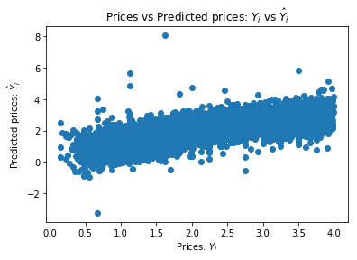
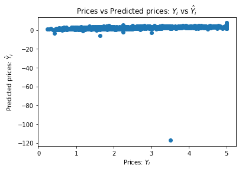
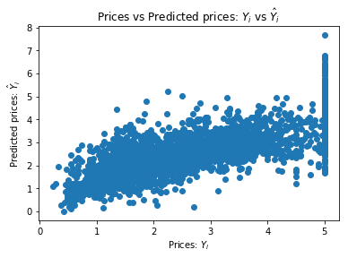

# Scikit-learn

Today we will be talking about `Scikit-learn`


```python
import sklearn
import numpy as np
```

# Data analisys

Let's fetch some dataset. Not completly at random, but neither a known one. Just something we can start with.


```python
from sklearn.datasets.california_housing import fetch_california_housing
```

There are other datasets available. Usually these are used to experiment and learn and most importantly **debug** an algorithm/model before switching to an internal dataset. Let's see some of them:


```python
[dataset for dataset in sklearn.datasets.__dict__.keys() if str(dataset).startswith("fetch_") or str(dataset).startswith("load_")]
```


    ['load_diabetes',
     'load_digits',
     'load_files',
     'load_iris',
     'load_breast_cancer',
     'load_linnerud',
     'load_boston',
     'load_sample_images',
     'load_sample_image',
     'fetch_covtype',
     'fetch_kddcup99',
     'load_mlcomp',
     'load_lfw_pairs',
     'load_lfw_people',
     'fetch_lfw_pairs',
     'fetch_lfw_people',
     'fetch_20newsgroups',
     'fetch_20newsgroups_vectorized',
     'fetch_mldata',
     'load_svmlight_file',
     'load_svmlight_files',
     'fetch_olivetti_faces',
     'fetch_species_distributions',
     'fetch_california_housing',
     'fetch_rcv1']


```python
houses = fetch_california_housing()
```


```python
print(houses.DESCR)
```

    California housing dataset.
    
    The original database is available from StatLib
    
        http://lib.stat.cmu.edu/
    
    The data contains 20,640 observations on 9 variables.
    
    This dataset contains the average house value as target variable
    and the following input variables (features): average income,
    housing average age, average rooms, average bedrooms, population,
    average occupation, latitude, and longitude in that order.
    
    References
    ----------
    
    Pace, R. Kelley and Ronald Barry, Sparse Spatial Autoregressions,
    Statistics and Probability Letters, 33 (1997) 291-297.
    
    


```python
houses.feature_names
```


    ['MedInc',
     'HouseAge',
     'AveRooms',
     'AveBedrms',
     'Population',
     'AveOccup',
     'Latitude',
     'Longitude']


You can find a better description [here](http://www.dcc.fc.up.pt/~ltorgo/Regression/cal_housing.html)

It says something like:  

**California Housing**

This is a dataset obtained from the StatLib repository. Here is the included description:

S&P Letters Data
We collected information on the variables using all the block groups in California from the 1990 Cens us. In this sample a block group on average includes 1425.5 individuals living in a geographically co mpact area. Naturally, the geographical area included varies inversely with the population density. W e computed distances among the centroids of each block group as measured in latitude and longitude. W e excluded all the block groups reporting zero entries for the independent and dependent variables. T he final data contained 20,640 observations on 9 variables. **The dependent variable is ln(median house value).**


|                               | Bols    | tols |
|:----|----:|----:|
| INTERCEPT		 |      11.4939 | 275.7518 |
| MEDIAN INCOME	|       0.4790  | 45.7768 |
| MEDIAN INCOME2	 |      -0.0166 | -9.4841 |
| MEDIAN INCOME3	  |     -0.0002 | -1.9157 |
| ln(MEDIAN AGE)	   |    0.1570 | 33.6123 |
| ln(TOTAL ROOMS/ POPULATION) |   -0.8582 | -56.1280 |
| ln(BEDROOMS/ POPULATION)     |  0.8043 | 38.0685 |
| ln(POPULATION/ HOUSEHOLDS)    | -0.4077 | -20.8762 |
| ln(HOUSEHOLDS)	  |     0.0477 | 13.0792 |

The file contains all the the variables. Specifically, it contains median house value, med ian income, housing median age, total rooms, total bedrooms, population, households, latitude, and lo ngitude in that order.


```python
houses.data.shape
```


    (20640, 8)


One of the **rows** in the dataset


```python
houses.data[100]
```


    array([  2.49120000e+00,   2.90000000e+01,   3.72480000e+00,
             1.13120000e+00,   2.30400000e+03,   1.84320000e+00,
             3.78100000e+01,  -1.22250000e+02])


So the `target` variables contain the prices of the houses in ln form. We will use the e^x function, alias `exp` to invert the `ln` and get the price of the house 


```python
import math
math.exp(houses.target[0])
```


    92.38826791783592


# Test, CV, Train split

First, let's see how much data do we have


```python
samples = houses.data.shape[0]
samples
```


    20640


The current best practices right now suggest splitting your data into 70% - train set, 15% - cv set, 15% - test set with the following restrictions:

* the train set is used to **fit** any model
* the cross-validation set is used to **monitor** how good the above model is performing on unseen data
    * The CV is also used to figure out other **hyperparamters**
* the test set is only used **once** (idealy) at the end, before pushing to prod, just to see how it will perform.
    * Please avoid looking at the test set!!

Calculate the split points for every set.

We will use the form `data[start:stop]` called `slices` in order to do this, so we need to compute the `start` and `stop` values for each.

## Easy way


```python
train_start = 0
train_end = 0.70 * samples

valid_start = 0.70 * samples
valid_end = 0.85 * samples

tests_start = 0.85 * samples
tests_end = 1.0 * samples
```


```python
train_inputs = houses.data[:int((0.75) * samples), :]
train_labels = houses.target[:int((0.75) * samples)]

valid_inputs = houses.data[int((0.75) * samples):int((0.85) * samples), :]
valid_labels = houses.target[int((0.75) * samples):int((0.85) * samples)]

tests_inputs = houses.data[int((0.85) * samples):, :]
tests_labels = houses.target[int((0.85) * samples):]
```

## Cool way (zip + numpy)

Another smarter way to do this is by using `zip`. This creates pairs between two lists.


```python
slice_points = [0, 0.7, 0.85, 1]
slice_points = list(zip(slice_points, slice_points[1:]))
slice_points
```


    [(0, 0.7), (0.7, 0.85), (0.85, 1)]


Now that we have the slice points we need to scale them to the `sample` size


```python
slice_points = np.array(slice_points) * samples
slice_points
```


    array([[     0.,  14448.],
           [ 14448.,  17544.],
           [ 17544.,  20640.]])


And... let's use the splits


```python
train_inputs, valid_inputs, tests_inputs = [houses.data[int(start):int(stop)] for start, stop in slice_points]
train_inputs.shape, valid_inputs.shape, tests_inputs.shape
```


    ((14447, 8), (3097, 8), (3096, 8))


Also, do this for the `target` part


```python
train_labels, valid_labels, tests_labels = [houses.target[int(start): int(stop)] for start, stop in slice_points]
assert train_inputs.shape[0] == train_labels.shape[0]
assert valid_inputs.shape[0] == valid_labels.shape[0]
assert tests_inputs.shape[0] == tests_labels.shape[0]
```

## The scikit-learn way

We can use `sklearn.model_selection.train_test_split` function in order not to reimplement the wheel as we did above.

We only need to call it twice to split our dataset in three as we want it.


```python
train_inputs, rest_inputs, train_labels, rest_labels = sklearn.cross_validation.train_test_split(houses.data, houses.target, test_size = 0.30)
valid_inputs, tests_inputs, valid_labels, tests_labels = sklearn.cross_validation.train_test_split(rest_inputs, rest_labels, test_size = 0.5)
```

# Regression

The dataset that we've seen requires us to **model** them so as to get out **numbers** when we evaluate the model. This is called a **regression** because we will try to define a generic function `f(x1, x2, .., xn)` that can output our desired `y` (i.e. `target`) values for the corresponding `X=[x1, x2, ..., xn]` rows.

So we will try to *regress* `X` on `f`. 

As a tip, whenever you hear the word **regression** you need to understand that what is needed is a model that can output continous values (eg. prices, weights, dimensions, etc..).

Also, on the other way around, when you are required to model some data and need to predict a value, not a class, what you need is a way of regression.

## Linear Regression

### The theory

Remember what linear regression was.. fitting data to a line


Unfortunately, in ML we deal with multidimensional data (i.e. more than (x,y) pairs). So the initial formula:
```
    y = a*x + b
```

is only good on toy problems.

Our data is like `X:(x1, x2, x3, ... ) => y` so the function that models `y` needs to receive as inputs, and use, all the paramters of X! 

`f(x1, x2, ..., xn) = a1*x1 + a2*x2 + a3*x3 + .. an*xn + b`


So the **hypotesys** or model (y) is now: 


Our goal now is to find the *beta* and *epsilon* paramters.

### The (fun stuff) code

Back to sckit-learn land...

Every model class is either one, or a combination of a `Transformer` or a `Predictor`


```python
class Transformer():
    """
    A transformer usually takes a dataset X and applyies a transformation on it (eg. absolute value on every field)
    """
    def fit(self, X, y):
        """
        On some types of transformers, we need to do a 2-pass scan over the data.
        The first is called a **fit** pass that computes some needed values for the second pass.
        """
        pass
    
    def transform(self, X):
        """
        The actual transformation happens here, when calling with the dataset X 
        """
        pass
    
    def fit_transform(self, X):
        """
        Ocasionally, on the 2-pass / statefull transformers, we can find a **syntactic sugar** call that does 
        both passes in a single call (fit + transform)
        """
        pass
```


```python
class Predictor():
    """
    Class that can **learn** from a dataset and some labels, and can then be used in order to make new predictions.
    This is what a **model** in scikit-learn is.
    """
    def fit(X, y):
        """
        Before making predictions, we need to learn the model, by calling this method.
        X is the input data
        y are the labels
        """
        pass
    
    def predict(X):
        """
        We use predict to make predictions on new data
        """
        pass
    
    def fit_predict(X, y):
        """
        Convenience method that does both fit and predict at the same time.
        This isn't as usefull as fit_transform because you won't usually need the predicted values 
        of the data that you just used for learning the model. One case when this may be usefull is to monitor 
        the error on the trained data.
        """
        pass
```

You may find classes that implement both `transform` and `predict`.  


```python
from sklearn.linear_model import LinearRegression
```


```python
lm = LinearRegression()
```


```python
lm.fit(X=train_inputs, y=train_labels)
```


    LinearRegression(copy_X=True, fit_intercept=True, n_jobs=1, normalize=False)


```python
valid_pred = lm.predict(valid_inputs)
```


```python
train_pred = lm.predict(train_inputs)
```

## Evaluating how good the model works

First, let's print some examples


```python
s = [1, 10, 100]
valid_labels[s], valid_pred[s]
```


    (array([ 4.5    ,  5.00001,  4.259  ]),
     array([ 2.41614771,  2.50028634,  3.33485518]))


And maybe a graph..


```python
from matplotlib import pyplot as plt

plt.scatter(train_labels[train_labels < 4], train_pred[train_labels < 4])
plt.xlabel("Prices: $Y_i$")
plt.ylabel("Predicted prices: $\hat{Y}_i$")
plt.title("Prices vs Predicted prices: $Y_i$ vs $\hat{Y}_i$")
```


    Text(0.5,1,'Prices vs Predicted prices: $Y_i$ vs $\\hat{Y}_i$')





A good way to measure regression tasks is to compute the average distance between the predictions and the expected values. 

There are a lot of ways that you can think about measuring this, but the "standard" measure for this is to use the MSE (mean squared error).

Luckly, scikit-learn has a function already implemented for this in the module named `metrics`


```python
from sklearn.metrics import mean_squared_error
```

The error on the training set.


```python
mean_squared_error(train_labels, lm.predict(train_inputs))
```


    0.50495628502094114


The error on the validation set.


```python
mean_squared_error(valid_labels, valid_pred)
```


    0.80994735087881187


So, on average we have the a deviation of 0.8 on every prediction... Remembed that this is a ln() value. What does that mean in actual dollars?


```python
import math
int(math.exp(0.8) * 1000)
```


    2225


We need to be better than this. A $2225 on every purchase is a costly mistake!  

# Normalisation of the data

The first optimisation that we can do is normalize the inputs. 

* Why do we need normalisation 

* What does this involve?

The intention is to align **all** feature distributions to a small [normal distribution](https://en.wikipedia.org/wiki/Normal_distribution).


Usually, in ML the most common normalisation is the [Standard score](https://en.wikipedia.org/wiki/Standard_score)


First, make sure that our assumption, that the features are not normalized is true, by computing the mean and the standard deviation of one feature.


```python
np.mean(train_inputs[:, 0]), np.std(train_inputs[:, 0])
```


    (3.7857348446044159, 1.8973481317819312)


A normalized feature should have mean = 0 and std = 1, so our dataset isn't normalized.

Scikit-learn has a nice class that does this for us, called `StandardScaler`


```python
new_features = StandardScaler().fit_transform(X=train_inputs)
```

We should now have normalized features


```python
feature = 1
round(np.mean(new_features[:, 1]), 5), np.std(new_features[:, 1])
```


    (0.0, 1.0)


# Pipelines

In order to combine a `Predictor` and multiple `Transforms` we use `Pipelines`. 


```python
from sklearn.pipeline import Pipeline
```


```python
lm_1 = Pipeline([
    ('normalizer', StandardScaler()),
    ('regressor', LinearRegression())
]).fit(train_inputs, train_labels)
```


```python
def loss(model):
    train_loss = mean_squared_error(train_labels, model.predict(train_inputs))
    valid_loss = mean_squared_error(valid_labels, model.predict(valid_inputs))
    return train_loss, valid_loss

loss(lm_1)
```


    (0.50495628502094114, 0.80994735087881431)


Well, it didn't do much good since on a linear model, there's not much of a need to have the features scaled, but it's a good practice to have in mind, and we also needed a way to introduce `Pipelines`.

# Polynomial features

Our initial assumption was that the features could be tied in a weighted sum, on order to recompute the price of a house, but maybe this isn't enough..


```python
houses.feature_names
```


    ['MedInc',
     'HouseAge',
     'AveRooms',
     'AveBedrms',
     'Population',
     'AveOccup',
     'Latitude',
     'Longitude']


On a second look ove the data, some of the features might not be corelated linearly with the price of the house. 

Take for example the `HouseAge` param. A reasonable expectation is that wheather a house is 2 or 5 years old won't count much on the price, but it will count quite a bit if the house is more than 50 year old. In fact, the price and the age might have a quadratic relation like `price ~= age^2` 

If we need to model this assumption into our model we want to also have 
```
`f(x1, x2, ..., xn) = a1*x1 + a1'*x1^2 + a2*x2 + a2'*x2^2 + .. + b`
```

So for each x_i we need to add a new feature that is x_i^2

In scikit-learn world this is called a `polynomial feature` transform


```python
from sklearn.preprocessing import PolynomialFeatures
```

This not only that it adds x_i^2 but also every combination of x_i * x_j, because they might also do good for the model (and also to have a complete representation of the second degree polynomial function)


```python
lm_2 = Pipeline([
    ("normalizer", StandardScaler()),
    ("poli-feature", PolynomialFeatures(degree=2)),
    ("regressor", LinearRegression())
])
```


```python
lm_2.fit(train_inputs, train_labels)
```


    Pipeline(steps=[('normalizer', StandardScaler(copy=True, with_mean=True, with_std=True)), ('poli-feature', PolynomialFeatures(degree=2, include_bias=True, interaction_only=False)), ('regressor', LinearRegression(copy_X=True, fit_intercept=True, n_jobs=1, normalize=False))])


```python
s = [1, 10, 100]
valid_labels[s], lm_2.predict(valid_inputs[s])
```


    (array([ 4.5    ,  5.00001,  4.259  ]),
     array([ 2.95001462,  2.96427055,  3.51599654]))


```python
valid_pred = lm_2.predict(valid_inputs)
```


```python
mean_squared_error(valid_labels, valid_pred)
```


    5.4364396623820248


Hmm... that number is a bit to hight I would say.


```python
from matplotlib import pyplot as plt

def chart(labels, predictions):
    plt.scatter(labels, predictions)
    plt.xlabel("Prices: $Y_i$")
    plt.ylabel("Predicted prices: $\hat{Y}_i$")
    plt.title("Prices vs Predicted prices: $Y_i$ vs $\hat{Y}_i$")
chart(valid_labels, lm_2.predict(valid_inputs))
```





How many of the predictions are bellow 0? These are clearly invalid prediction that we can filter out of the model


```python
sum(valid_pred < 0)
```


    8


Let's see, if we remove the <0 outliers how good results we get now..


```python
mean_squared_error(valid_labels[valid_pred > 0], valid_pred[valid_pred > 0])
```


    0.70775997495085441


A bit better than 0.8 on the initial model. And in actual dollars that is:


```python
math.exp(0.7) * 1000
```


    2013.7527074704767


So we "bettered" our errors from 2225 dollars to 2013, almost 10% relative improvement.


```python
chart(valid_labels[valid_pred > 0], valid_pred[valid_pred > 0])
```





```python
loss(lm_2)
```


    (0.3890135488695402, 5.4364396623820248)


# But there are allways problems

Somehow the numbers from above don't add up.. 

There almost seems like the validation and the train set are really different. 

The problem is.. we didn't shuffle the data before doing the split..


```python
permutation = np.random.permutation(samples)
houses.data[permutation] = houses.data
houses.target[permutation] = houses.target
```


```python
train_inputs, valid_inputs, tests_inputs = [houses.data[int(start):int(stop)] for start, stop in slice_points]
train_labels, valid_labels, tests_labels = [houses.target[int(start): int(stop)] for start, stop in slice_points]
```


```python
lm_2.fit(train_inputs, train_labels)
loss(lm_2)
```


    (0.38111911671425164, 0.37712864656948669)


We now have much mode even distribution of the prediction errors between the train set and the validation set.

In actual $, that is:


```python
math.exp(0.38) * 1000
```


    1462.2845894342245


# Regularisation

Maybe the last piece of the puzzle is a way to make the model not **overfitt**


```python
from sklearn.linear_model import Ridge
```


```python
from sklearn.linear_model import Ridge

lm_3 = Pipeline([
    ('normalizer', StandardScaler()),
    ('poly-feat', PolynomialFeatures(degree=3)),
    ('regressor', Ridge())
]).fit(train_inputs, train_labels)

loss(lm_3)
```


    (0.29597197957945243, 0.35942785842383213)


# [Dum, Dum, Duuum] The test set results!


```python
mean_squared_error(tests_labels, lm_1.predict(tests_inputs))
```


    0.50498874942844496


```python
mean_squared_error(tests_labels, lm_2.predict(tests_inputs))
```


    0.41005045194439044


```python
mean_squared_error(tests_labels, lm_3.predict(tests_inputs))
```


    0.37059292499997382


So, yes! Our optimisations did work! We improved the test results (without looking at them) by using the cross-validation dataset to find the best hyperparameters (transformers, what type of reguralization to use, the alpha, beta, gama param stuff, etc..)

But remember, only at the end!
