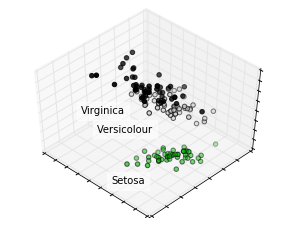
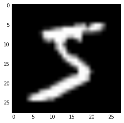
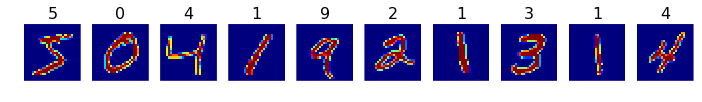
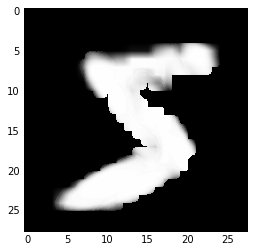

# Intuition

Every presentation starts with a cat


If I show you one, what do you see?

* has fur
* black eyes
* two ears
* sits
* looks away from the camera


* small 
* mamal
* likes to cuddle
* eats mice
...

# Maths embeddings

In mathematics, an embedding (or imbedding) is one instance of some mathematical structure contained within another instance, such as a group that is a subgroup. (wikipedia)

.... (!)

In IT we say it's a mapping (form A to B)

# Embeddings as expansions 

The first use-case (and arguably the most common one) is expanding an element into some semantic values (latent variables).

## Word embeddings

We will try to attach for each word, a "meaning" (a semantic context). 
We interpret "context" as whatever words are, before (or after our target word). So we will get a dataset that parses free text, and slides a window of a certain size over the full text.

In this example we're going to use:
* 3 words sized window, 1 word prediction

ETL.. get the data, process it and load it in a specific format


```python
%matplotlib inline
import numpy as np
from matplotlib import pyplot as plt 

from scipy import io
from keras.utils.np_utils import to_categorical

mat = io.loadmat("./data/word-embeddings.mat")
data = mat['data']['trainData'][0][0] - 1 # in octave arrays start from one

vocab = np.array([element[0] for element in mat['data']['vocab'][0][0].reshape(250)])

inputs = data[:3, :].T
label_index = data[3, :]
labels = to_categorical(label_index)
```

Printing some examples, to get a feel of what we are working with


```python
first = 10
list(zip(
    [[vocab[i] for i in words] for words in inputs[:first]], 
    [vocab[l] for l in label_index[:first]]
))
```


    [([u'going', u'to', u'be'], u'.'),
     ([u'were', u'not', u'the'], u'first'),
     ([u'can', u'do', u'for'], u'each'),
     ([u'first', u'time', u'in'], u'my'),
     ([u'nt', u'have', u'the'], u'money'),
     ([u'know', u'what', u'to'], u'do'),
     ([u'i', u'do', u'nt'], u'do'),
     ([u'nt', u'do', u'that'], u'.'),
     ([u'what', u'do', u'you'], u'do'),
     ([u'know', u'is', u'we'], u'are')]


```python
import keras
from keras.layers import Input
from keras.layers import Embedding
from keras.layers import merge, Lambda, Reshape, Dense, BatchNormalization
from keras.models import Model
from keras import backend as K
from keras.layers import Activation
from keras.regularizers import l2

inp_1 = Input(shape=(1,), dtype='int32')
inp_2 = Input(shape=(1,), dtype='int32')
inp_3 = Input(shape=(1,), dtype='int32')

lbl = Input(shape=(1,), dtype='int32')

DIMS = 5
word_emb = Embedding(input_dim=len(vocab), output_dim=(DIMS), W_regularizer=l2(0.0001))

emb_1 = word_emb(inp_1)
emb_2 = word_emb(inp_2)
emb_3 = word_emb(inp_3)

out = Reshape((-1,))(merge([emb_1, emb_2, emb_3], mode='concat'))
out = Dense(output_dim=len(vocab), activation='softmax')(out)
word_model = Model(input=[inp_1, inp_2, inp_3], output=out)
word_model.compile(optimizer='adam', loss='categorical_crossentropy')
word_model.summary()
```

    ____________________________________________________________________________________________________
    Layer (type)                     Output Shape          Param #     Connected to                     
    ====================================================================================================
    input_1 (InputLayer)             (None, 1)             0                                            
    ____________________________________________________________________________________________________
    input_2 (InputLayer)             (None, 1)             0                                            
    ____________________________________________________________________________________________________
    input_3 (InputLayer)             (None, 1)             0                                            
    ____________________________________________________________________________________________________
    embedding_1 (Embedding)          (None, 1, 5)          1250        input_1[0][0]                    
                                                                       input_2[0][0]                    
                                                                       input_3[0][0]                    
    ____________________________________________________________________________________________________
    merge_1 (Merge)                  (None, 1, 15)         0           embedding_1[0][0]                
                                                                       embedding_1[1][0]                
                                                                       embedding_1[2][0]                
    ____________________________________________________________________________________________________
    reshape_1 (Reshape)              (None, 15)            0           merge_1[0][0]                    
    ____________________________________________________________________________________________________
    dense_1 (Dense)                  (None, 250)           4000        reshape_1[0][0]                  
    ====================================================================================================
    Total params: 5,250
    Trainable params: 5,250
    Non-trainable params: 0
    ____________________________________________________________________________________________________


```python
word_model.fit([inputs[:, 0], inputs[:, 1], inputs[:, 2]], labels)
```

    Epoch 1/10
    372550/372550 [==============================] - 37s - loss: 3.6846    
    Epoch 2/10
    372550/372550 [==============================] - 37s - loss: 3.3462    
    Epoch 3/10
    372550/372550 [==============================] - 35s - loss: 3.2946    
    Epoch 4/10
    372550/372550 [==============================] - 34s - loss: 3.2680    
    Epoch 5/10
    372550/372550 [==============================] - 34s - loss: 3.2508    
    Epoch 6/10
    372550/372550 [==============================] - 36s - loss: 3.2389    
    Epoch 7/10
    372550/372550 [==============================] - 38s - loss: 3.2302    
    Epoch 8/10
    372550/372550 [==============================] - 38s - loss: 3.2232    
    Epoch 9/10
    372550/372550 [==============================] - 39s - loss: 3.2177    
    Epoch 10/10
    372550/372550 [==============================] - 39s - loss: 3.2130    


    <keras.callbacks.History at 0x7fc787b17190>


Building a reversible dictionary


```python
vocab2id = {word: id for id, word in enumerate(vocab)}
assert vocab[vocab2id['going']] == 'going'
```

Getting the actuall embeddings


```python
embeddings = word_emb.get_weights()[0]
```

What are the words that are the most similar to one another?


```python
from scipy.spatial.distance import cosine
word = 'going'

def most_similar_words(word):
    t_id = vocab2id[word]
    t_emb = embeddings[t_id]
    return [vocab[id] for id in np.argsort([cosine(t_emb, w_emb) for w_emb in embeddings])[:10]]

most_similar_words('war')
```


    [u'war',
     u'country',
     u'season',
     u'business',
     u'game',
     u'house',
     u'here',
     u'music',
     u'company',
     u'office']


## Word2Vec, Glove

In NLP, the above is just the first thing that you usually do before you want to process text (i.e. substituting words with their embeddings).

Fortunately, there were many attempts (and many companies) that trained word embeddings on large corpus-es (and their expense) but made available the results.

Examples of public word embeddings libraries:
* [Word2Vec](https://code.google.com/archive/p/word2vec/) (Google)
* [GloVe](https://nlp.stanford.edu/projects/glove/) (Stanford)
* [FastText](https://github.com/facebookresearch/fastText/blob/master/pretrained-vectors.md) (Facebook)

The most famous one, word2vec has the following two strategies used to training the embeddings:


(Continuous Bag of Words), (Skip Gram model)

These embeddings have some pretty cool properties:


One downside of embeddings is that they are specific to what they have been trained on.
In this case, English word embeddings are specific, to English and don't relate in any way to embeddings of other languages (except for the fact that distances between equivalent words should have roughly the same values)

### Same space aligned embeddings

You can also have embeddings aligned in the same vector space

FastText embeddings have a [git repo](https://github.com/Babylonpartners/fastText_multilingual) that you can use to align all the 190 language embeddings on the same vector space.

One thing that you can use them for is to do a quick, dirty and imperfect translation mechanism, where for each word in language A, you take it's embeddings, and search the closest embedding form language B. Having found that embedding you can now substitute it with the word it stands for.

Bellow is a translation done using this mechanism.

```acesta este un text frumos scris```


```lui est un texte plaisant écrit```

## Elemental embeddings

Another use-case for embeddings is expanding your own elements into a "semantic" representation.

We will be using a wine-selection [dataset](https://www.kaggle.com/zynicide/wine-reviews) hosted on Kaggle.


```python
import pandas as pd
from IPython.display import display
table = pd.read_json('./winemag-data-130k-v2.json', encoding = "ISO-8859-1")
display(table.head())
```


<div>
<table border="1" class="dataframe">
  <thead>
    <tr style="text-align: right;">
      <th></th>
      <th>country</th>
      <th>description</th>
      <th>designation</th>
      <th>points</th>
      <th>price</th>
      <th>province</th>
      <th>region_1</th>
      <th>region_2</th>
      <th>taster_name</th>
      <th>taster_twitter_handle</th>
      <th>title</th>
      <th>variety</th>
      <th>winery</th>
    </tr>
  </thead>
  <tbody>
    <tr>
      <th>0</th>
      <td>Italy</td>
      <td>Aromas include tropical fruit, broom, brimston...</td>
      <td>Vulkà Bianco</td>
      <td>87</td>
      <td>NaN</td>
      <td>Sicily &amp; Sardinia</td>
      <td>Etna</td>
      <td>None</td>
      <td>Kerin O’Keefe</td>
      <td>@kerinokeefe</td>
      <td>Nicosia 2013 Vulkà Bianco  (Etna)</td>
      <td>White Blend</td>
      <td>Nicosia</td>
    </tr>
    <tr>
      <th>1</th>
      <td>Portugal</td>
      <td>This is ripe and fruity, a wine that is smooth...</td>
      <td>Avidagos</td>
      <td>87</td>
      <td>15.0</td>
      <td>Douro</td>
      <td>None</td>
      <td>None</td>
      <td>Roger Voss</td>
      <td>@vossroger</td>
      <td>Quinta dos Avidagos 2011 Avidagos Red (Douro)</td>
      <td>Portuguese Red</td>
      <td>Quinta dos Avidagos</td>
    </tr>
    <tr>
      <th>2</th>
      <td>US</td>
      <td>Tart and snappy, the flavors of lime flesh and...</td>
      <td>None</td>
      <td>87</td>
      <td>14.0</td>
      <td>Oregon</td>
      <td>Willamette Valley</td>
      <td>Willamette Valley</td>
      <td>Paul Gregutt</td>
      <td>@paulgwine</td>
      <td>Rainstorm 2013 Pinot Gris (Willamette Valley)</td>
      <td>Pinot Gris</td>
      <td>Rainstorm</td>
    </tr>
    <tr>
      <th>3</th>
      <td>US</td>
      <td>Pineapple rind, lemon pith and orange blossom ...</td>
      <td>Reserve Late Harvest</td>
      <td>87</td>
      <td>13.0</td>
      <td>Michigan</td>
      <td>Lake Michigan Shore</td>
      <td>None</td>
      <td>Alexander Peartree</td>
      <td>None</td>
      <td>St. Julian 2013 Reserve Late Harvest Riesling ...</td>
      <td>Riesling</td>
      <td>St. Julian</td>
    </tr>
    <tr>
      <th>4</th>
      <td>US</td>
      <td>Much like the regular bottling from 2012, this...</td>
      <td>Vintner's Reserve Wild Child Block</td>
      <td>87</td>
      <td>65.0</td>
      <td>Oregon</td>
      <td>Willamette Valley</td>
      <td>Willamette Valley</td>
      <td>Paul Gregutt</td>
      <td>@paulgwine</td>
      <td>Sweet Cheeks 2012 Vintner's Reserve Wild Child...</td>
      <td>Pinot Noir</td>
      <td>Sweet Cheeks</td>
    </tr>
  </tbody>
</table>
</div>


We're only going to take 'taster_name', 'variety' and 'country' fields into account.


```python
def count_unique(column_name):
    return len(table[column_name].unique())

count_unique('taster_name'), count_unique('variety'), count_unique('country')
```


    (20, 708, 44)


See that we have values for all the point rows 


```python
import numpy as np
sum(np.isnan(table['points'].values))
```


    0


```python
table['taster_name'].unique()
```


    array([u'Kerin O\u2019Keefe', u'Roger Voss', u'Paul Gregutt',
           u'Alexander Peartree', u'Michael Schachner', u'Anna Lee C. Iijima',
           u'Virginie Boone', u'Matt Kettmann', None, u'Sean P. Sullivan',
           u'Jim Gordon', u'Joe Czerwinski', u'Anne Krebiehl\xa0MW',
           u'Lauren Buzzeo', u'Mike DeSimone', u'Jeff Jenssen',
           u'Susan Kostrzewa', u'Carrie Dykes', u'Fiona Adams',
           u'Christina Pickard'], dtype=object)


Let's make some reversible dictionaries so we can restore the strings from ids and vice-versa


```python
taster2id = {taster: id for id, taster in enumerate(table['taster_name'].unique())}
id2taster = {id: taster for id, taster in enumerate(table['taster_name'].unique())}

variety2id = {taster: id for id, taster in enumerate(table['variety'].unique())}
id2variety = {id: taster for id, taster in enumerate(table['variety'].unique())}

country2id = {taster: id for id, taster in enumerate(table['country'].unique())}
id2country = {id: taster for id, taster in enumerate(table['country'].unique())}
```

Compiling a dataset that has only the above values and uses 'points' as labels


```python
data = np.array([[taster2id[t], variety2id[v], country2id[c]] for t, v, c in table[['taster_name', 'variety', 'country']].values])

labels = table[['points']].values
assert data.shape[0] == labels.shape[0]

# print some examples
list(zip(data[5:10], labels[5:10]))
```


    [(array([4, 5, 3]), array([87])),
     (array([0, 6, 0]), array([87])),
     (array([1, 7, 4]), array([87])),
     (array([5, 7, 5]), array([87])),
     (array([1, 2, 4]), array([87]))]


The embeddings model just translates the element ids into embedded values. We dot product all the permutation and expect that their sum is equal to the predicted price. 

We also add some bias terms to account for the specific 'biases' of each element.


```python
import keras
from keras.layers import Input
from keras.layers import Embedding
from keras.layers import merge, Lambda, Reshape, Dense, BatchNormalization
from keras.models import Model
from keras import backend as K
from keras.layers import Activation
from keras.regularizers import l2

nam_inp = Input(shape=(1,), dtype='int32')
var_inp = Input(shape=(1,), dtype='int32')
cty_inp = Input(shape=(1,), dtype='int32')

DIMS = 10

lbl = Input(shape=(1,), dtype='int32')

nam_emb = Embedding(input_dim=len(taster2id), output_dim=(DIMS), W_regularizer=l2(0.0001))
nam_bis = Embedding(input_dim=len(taster2id), output_dim=1, init='zero')

var_emb = Embedding(input_dim=len(variety2id), output_dim=(DIMS), W_regularizer=l2(0.0001))
var_bis = Embedding(input_dim=len(variety2id), output_dim=1, init='zero')

cty_emb = Embedding(input_dim=len(country2id), output_dim=(DIMS), W_regularizer=l2(0.0001))
cty_bis = Embedding(input_dim=len(country2id), output_dim=1, init='zero')


nam_rsh = BatchNormalization(axis=1)(Reshape((-1, 1))(nam_emb(nam_inp)))
var_rsh = BatchNormalization(axis=1)(Reshape((-1, 1))(var_emb(var_inp)))
cty_rsh = BatchNormalization(axis=1)(Reshape((-1, 1))(cty_emb(cty_inp)))

dot1 = merge([nam_rsh, var_rsh], mode='dot', dot_axes=1)
dot2 = merge([nam_rsh, cty_rsh], mode='dot', dot_axes=1)
dot3 = merge([var_rsh, cty_rsh], mode='dot', dot_axes=1)

dot = merge([dot1, dot2, dot3], mode='sum')

dot = merge([dot, nam_bis(nam_inp)], mode='sum')
dot = merge([dot, var_bis(var_inp)], mode='sum')
dot = merge([dot, cty_bis(cty_inp)], mode='sum')
dot = Reshape((1,))(dot)

out = Activation(activation='relu')(dot)

model = Model([nam_inp, var_inp, cty_inp], out)
model.summary()
model.compile(optimizer='rmsprop', loss='mae')
```

    ____________________________________________________________________________________________________
    Layer (type)                     Output Shape          Param #     Connected to                     
    ====================================================================================================
    input_5 (InputLayer)             (None, 1)             0                                            
    ____________________________________________________________________________________________________
    input_6 (InputLayer)             (None, 1)             0                                            
    ____________________________________________________________________________________________________
    input_7 (InputLayer)             (None, 1)             0                                            
    ____________________________________________________________________________________________________
    embedding_2 (Embedding)          (None, 1, 10)         200         input_5[0][0]                    
    ____________________________________________________________________________________________________
    embedding_4 (Embedding)          (None, 1, 10)         7080        input_6[0][0]                    
    ____________________________________________________________________________________________________
    embedding_6 (Embedding)          (None, 1, 10)         440         input_7[0][0]                    
    ____________________________________________________________________________________________________
    reshape_2 (Reshape)              (None, 10, 1)         0           embedding_2[0][0]                
    ____________________________________________________________________________________________________
    reshape_3 (Reshape)              (None, 10, 1)         0           embedding_4[0][0]                
    ____________________________________________________________________________________________________
    reshape_4 (Reshape)              (None, 10, 1)         0           embedding_6[0][0]                
    ____________________________________________________________________________________________________
    batchnormalization_1 (BatchNorma (None, 10, 1)         40          reshape_2[0][0]                  
    ____________________________________________________________________________________________________
    batchnormalization_2 (BatchNorma (None, 10, 1)         40          reshape_3[0][0]                  
    ____________________________________________________________________________________________________
    batchnormalization_3 (BatchNorma (None, 10, 1)         40          reshape_4[0][0]                  
    ____________________________________________________________________________________________________
    merge_2 (Merge)                  (None, 1, 1)          0           batchnormalization_1[0][0]       
                                                                       batchnormalization_2[0][0]       
    ____________________________________________________________________________________________________
    merge_3 (Merge)                  (None, 1, 1)          0           batchnormalization_1[0][0]       
                                                                       batchnormalization_3[0][0]       
    ____________________________________________________________________________________________________
    merge_4 (Merge)                  (None, 1, 1)          0           batchnormalization_2[0][0]       
                                                                       batchnormalization_3[0][0]       
    ____________________________________________________________________________________________________
    merge_5 (Merge)                  (None, 1, 1)          0           merge_2[0][0]                    
                                                                       merge_3[0][0]                    
                                                                       merge_4[0][0]                    
    ____________________________________________________________________________________________________
    embedding_3 (Embedding)          (None, 1, 1)          20          input_5[0][0]                    
    ____________________________________________________________________________________________________
    merge_6 (Merge)                  (None, 1, 1)          0           merge_5[0][0]                    
                                                                       embedding_3[0][0]                
    ____________________________________________________________________________________________________
    embedding_5 (Embedding)          (None, 1, 1)          708         input_6[0][0]                    
    ____________________________________________________________________________________________________
    merge_7 (Merge)                  (None, 1, 1)          0           merge_6[0][0]                    
                                                                       embedding_5[0][0]                
    ____________________________________________________________________________________________________
    embedding_7 (Embedding)          (None, 1, 1)          44          input_7[0][0]                    
    ____________________________________________________________________________________________________
    merge_8 (Merge)                  (None, 1, 1)          0           merge_7[0][0]                    
                                                                       embedding_7[0][0]                
    ____________________________________________________________________________________________________
    reshape_5 (Reshape)              (None, 1)             0           merge_8[0][0]                    
    ____________________________________________________________________________________________________
    activation_1 (Activation)        (None, 1)             0           reshape_5[0][0]                  
    ====================================================================================================
    Total params: 8,612
    Trainable params: 8,552
    Non-trainable params: 60
    ____________________________________________________________________________________________________


```python
model.fit([data[:, 0], data[:, 1], data[:, 2]], labels)
```

    Epoch 1/10
    129971/129971 [==============================] - 9s - loss: 29.1668     
    Epoch 2/10
    129971/129971 [==============================] - 8s - loss: 9.4990     
    Epoch 3/10
    129971/129971 [==============================] - 8s - loss: 3.8390     
    Epoch 4/10
    129971/129971 [==============================] - 8s - loss: 2.6311     
    Epoch 5/10
    129971/129971 [==============================] - 8s - loss: 2.4363     
    Epoch 6/10
    129971/129971 [==============================] - 10s - loss: 2.3623    
    Epoch 7/10
    129971/129971 [==============================] - 11s - loss: 2.3188    
    Epoch 8/10
    129971/129971 [==============================] - 9s - loss: 2.2963     
    Epoch 9/10
    129971/129971 [==============================] - 8s - loss: 2.2824     
    Epoch 10/10
    129971/129971 [==============================] - 8s - loss: 2.2726     


    <keras.callbacks.History at 0x7fc713320e90>


Trying to extract some meaning from the dimensions


```python
wines = np.array(var_emb.get_weights()[0])

# 0 - being Italian
# 1 - mainstream
# 3 - red-ness
# 8 - Sauvignon / Pinot (sweetness?)
for dimension in range(DIMS):
    print(dimension, [id2variety[v] for v in np.argsort(wines[:, dimension])][:5])
```

    (0, [u'Port', u'Albari\xf1o', u'Cabernet Sauvignon', u'Malbec', u'Nebbiolo'])
    (1, [u'Ros\xe9', u'Merlot', u'Cabernet Sauvignon', u'White Blend', u'Viognier'])
    (2, [u'Pinot Noir', u'Chardonnay', u'Cabernet Sauvignon', u'Champagne Blend', u'Malbec'])
    (3, [u'Bordeaux-style Red Blend', u'Syrah', u'Ros\xe9', u'Red Blend', u'Pinot Noir'])
    (4, [u'Pinot Noir', u'Champagne Blend', u'Chardonnay', u'Ros\xe9', u'Viognier'])
    (5, [u'Chenin Blanc', u'Pinot Grigio', u'Pinot Blanc', u'Tempranillo Blend', u'Rh\xf4ne-style Red Blend'])
    (6, [u'Ros\xe9', u'Red Blend', u'Syrah', u'Viognier', u'Champagne Blend'])
    (7, [u'Pinot Noir', u'Chardonnay', u'Ros\xe9', u'Syrah', u'Riesling'])
    (8, [u'Cabernet Sauvignon', u'Pinot Blanc', u'Pinot Gris', u'Pinot Noir', u'Sauvignon Blanc'])
    (9, [u'Petite Sirah', u'Meritage', u'Glera', u'Sauvignon', u'Tempranillo'])


```python
name_embeddings = np.array(nam_emb.get_weights()[0])

print(" ".join(["%.2f\t" % val for val in name_embeddings[0]]))
print(" ".join(["%.2f\t" % val for val in name_embeddings[10]]))

# list(name_embeddings[0]), list(name_embeddings[10])
```

    0.22	 0.16	 0.23	 -0.07	 -0.16	 -0.33	 -0.35	 -0.20	 0.07	 -0.02	
    0.12	 0.03	 0.21	 -0.29	 0.19	 0.11	 -0.27	 0.01	 -0.21	 -0.22	


## From all the examples we gave, observe the pattern?

We usually use embeddings when we want to reason about ids.

## Composite (event) embeddings

Go to previous [talk](http://www.clungu.com/Monitoring-media-for-terrorisim-with-AI/#the-embeddings-model)

If you train names as above, you're going to be able to do additive operations on the embeddings.

We’ve trained a model to derive name embeddings that we latter used to assemble “event embeddings”.

These can be used as indexes in a database (similar elements being close to one another).

The interesting thing about embeddings right now is that we can also use them to make intelligent “Google-like” queries: 
* “Air force” + “New York” + “Bombings” + “1980” -> “John Malcom”
	* [note: the above is just a made-up example]

# Sparse matrices to embeddings

Another example of embeddings usage is the case where we want to take a really large / sparse matrix and convert it to a reduced set value.

Arguably, Word2Vec has been [shown to do exactly this](http://www.aclweb.org/anthology/Q15-1016) (build the concurrence matrix and factor it down into a low-dimensional representation).

## PCA

Just to exemplify how this might work, we're going to take the [iris dataset](http://scikit-learn.org/stable/auto_examples/datasets/plot_iris_dataset.html) and use it to derive embeddings for each element.

Some ETL..


```python
from sklearn.decomposition import PCA
from sklearn import datasets

iris = datasets.load_iris()
X = iris.data
y = iris.target

pca = PCA(n_components=3)
pca.fit(X)
X_ = pca.transform(X)

X_[:10]
```


    array([[-2.68420713,  0.32660731, -0.02151184],
           [-2.71539062, -0.16955685, -0.20352143],
           [-2.88981954, -0.13734561,  0.02470924],
           [-2.7464372 , -0.31112432,  0.03767198],
           [-2.72859298,  0.33392456,  0.0962297 ],
           [-2.27989736,  0.74778271,  0.17432562],
           [-2.82089068, -0.08210451,  0.26425109],
           [-2.62648199,  0.17040535, -0.01580151],
           [-2.88795857, -0.57079803,  0.02733541],
           [-2.67384469, -0.1066917 , -0.1915333 ]])


Let's how each element decomposed on only three dimensions.


```python
from mpl_toolkits.mplot3d import Axes3D
fig = plt.figure(1, figsize=(4, 3))
plt.clf()
ax = Axes3D(fig, rect=[0, 0, .95, 1], elev=48, azim=134)
plt.cla()


for name, label in [('Setosa', 0), ('Versicolour', 1), ('Virginica', 2)]:
    ax.text3D(X[y == label, 0].mean(),
              X[y == label, 1].mean() + 1.5,
              X[y == label, 2].mean(), name,
              horizontalalignment='center',
              bbox=dict(alpha=.5, edgecolor='w', facecolor='w'))
# Reorder the labels to have colors matching the cluster results
y = np.choose(y, [1, 2, 0]).astype(np.float)
ax.scatter(X[:, 0], X[:, 1], X[:, 2], c=y, cmap=plt.cm.nipy_spectral,
           edgecolor='k')

ax.w_xaxis.set_ticklabels([])
ax.w_yaxis.set_ticklabels([])
ax.w_zaxis.set_ticklabels([])

plt.show()
```





## Auto-encoders

We can also create embeddings for multidimensional data using auto-encoders.

Auto-encoders model the function f, where f(x) = x

Auto-encoders have a "bottleneck" part where data is reduced to a low dimensional representation and then expanded back into the same dimension as the one we've started from.

The "bottleneck" output will be our encoding. 

We're going to use the MNIST dataset as well, to model what we've just said.

ETL... again


```python
from keras.datasets import mnist
(x_train, y_train), (x_test, y_test) = mnist.load_data()
```


```python
X = np.expand_dims(x_train, -1)
print(X.shape)

X_val = np.expand_dims(x_test, -1)

from keras.utils.np_utils import to_categorical
y = to_categorical(y_train)
y_val = to_categorical(y_test)
```

    (60000, 28, 28, 1)


```python
# Data shape
print(x_train.shape)

# show raw pixels
plt.imshow(x_train[0], cmap='gray')

# plot the first 10 images
plots(x_train[:10], titles=y_train[:10])
```

    (60000, 28, 28)








The model that we are going to create will look as follows


```python
from keras.layers import Input, Dense, Convolution2D, MaxPooling2D, UpSampling2D
from keras.models import Model

input_img = Input(shape=(28, 28, 1))

# -----------
# The encoder
# -----------
x = Convolution2D(16, 3, 3, activation='relu', border_mode='same')(input_img)
x = MaxPooling2D((2, 2), border_mode='same')(x)
x = Convolution2D(8, 3, 3, activation='relu', border_mode='same')(x)
x = MaxPooling2D((2, 2), border_mode='same')(x)
x = Convolution2D(8, 3, 3, activation='relu', border_mode='same')(x)
encoded = MaxPooling2D((2, 2), border_mode='same')(x)


# at this point the representation is (4, 4, 8) i.e. 128-dimensional


# -----------
# The decoder
# -----------
x = Convolution2D(8, 3, 3, activation='relu', border_mode='same')(encoded)
x = UpSampling2D((2, 2))(x)
x = Convolution2D(8, 3, 3, activation='relu', border_mode='same')(x)
x = UpSampling2D((2, 2))(x)
x = Convolution2D(16, 3, 3, activation='relu')(x)
x = UpSampling2D((2, 2))(x)
decoded = Convolution2D(1, 3, 3, activation='sigmoid', border_mode='same')(x)

autoencoder = Model(input_img, decoded)
autoencoder.compile(optimizer='adadelta', loss='mae')

autoencoder.summary()
```

    ____________________________________________________________________________________________________
    Layer (type)                     Output Shape          Param #     Connected to                     
    ====================================================================================================
    input_24 (InputLayer)            (None, 28, 28, 1)     0                                            
    ____________________________________________________________________________________________________
    convolution2d_47 (Convolution2D) (None, 28, 28, 16)    160         input_24[0][0]                   
    ____________________________________________________________________________________________________
    maxpooling2d_22 (MaxPooling2D)   (None, 14, 14, 16)    0           convolution2d_47[0][0]           
    ____________________________________________________________________________________________________
    convolution2d_48 (Convolution2D) (None, 14, 14, 8)     1160        maxpooling2d_22[0][0]            
    ____________________________________________________________________________________________________
    maxpooling2d_23 (MaxPooling2D)   (None, 7, 7, 8)       0           convolution2d_48[0][0]           
    ____________________________________________________________________________________________________
    convolution2d_49 (Convolution2D) (None, 7, 7, 8)       584         maxpooling2d_23[0][0]            
    ____________________________________________________________________________________________________
    maxpooling2d_24 (MaxPooling2D)   (None, 4, 4, 8)       0           convolution2d_49[0][0]           
    ____________________________________________________________________________________________________
    convolution2d_50 (Convolution2D) (None, 4, 4, 8)       584         maxpooling2d_24[0][0]            
    ____________________________________________________________________________________________________
    upsampling2d_19 (UpSampling2D)   (None, 8, 8, 8)       0           convolution2d_50[0][0]           
    ____________________________________________________________________________________________________
    convolution2d_51 (Convolution2D) (None, 8, 8, 8)       584         upsampling2d_19[0][0]            
    ____________________________________________________________________________________________________
    upsampling2d_20 (UpSampling2D)   (None, 16, 16, 8)     0           convolution2d_51[0][0]           
    ____________________________________________________________________________________________________
    convolution2d_52 (Convolution2D) (None, 14, 14, 16)    1168        upsampling2d_20[0][0]            
    ____________________________________________________________________________________________________
    upsampling2d_21 (UpSampling2D)   (None, 28, 28, 16)    0           convolution2d_52[0][0]           
    ____________________________________________________________________________________________________
    convolution2d_53 (Convolution2D) (None, 28, 28, 1)     145         upsampling2d_21[0][0]            
    ====================================================================================================
    Total params: 4,385
    Trainable params: 4,385
    Non-trainable params: 0
    ____________________________________________________________________________________________________


```python
autoencoder.fit(X, X,
                nb_epoch=10,
                batch_size=256,
                shuffle=True,
                validation_data=(X_val, X_val))
```

    Train on 60000 samples, validate on 10000 samples
    Epoch 1/3
    60000/60000 [==============================] - 79s - loss: 23.6325 - val_loss: 32.9488
    Epoch 2/3
    60000/60000 [==============================] - 79s - loss: 22.6607 - val_loss: 31.4966
    Epoch 3/3
    60000/60000 [==============================] - 81s - loss: 21.0491 - val_loss: 30.7882


Let's see the reconstruction of a single example


```python
plots(autoencoder.predict(np.array([X[0]])))
```





```python
encoder = Model(input_img, encoded)
```


```python
encoder.predict(X[:1])[0].shape
```


    (4, 4, 8)


In the end, the "embeddings" will can be mapped like this.


```python
def plots(ims, figsize=(12, 6), rows=1, interp=False, titles=None, display=False):
    if type(ims[0]) is np.ndarray:
        ims = np.array(ims).astype(np.uint8)
        if len(ims.shape) != 3:
            # Find out if the last dimension is not the color channel.
            # If we have K.dim_ordering('th') then the color channel is the second dimension
            # The code bellow ensures the images are in the K.dim_ordering('tf') format (channels last)
            if (ims.shape[-1] not in {1, 3}):
                # Take the color axis(1) and put it at the back(4)
                ims = ims.transpose((0, 2, 3, 1))
        else:
            # We have no color information, so no need to change the dimensions to put color on the back
            pass

    f = plt.figure(figsize=figsize)
    for i in range(len(ims)):
        sp = f.add_subplot(rows, len(ims) // rows, i + 1)
        sp.axis('Off')
        if titles is not None:
            sp.set_title(titles[i], fontsize=16)
        if ims.shape[-1] == 1:
            # Last axis is a single color channel so we can discard it and treat the data as a gray image
            plt.imshow(np.squeeze(ims[i]), interpolation=None if interp else 'none', cmap='gray')
        else:
            plt.imshow(ims[i], interpolation=None if interp else 'none')
    if display:
        return f
```

# Conclusions

* IDs always mean embeddings!
* NLP stands on the shoulders of word2vec, glove, fasttext
* Usually, embeddings are additive

