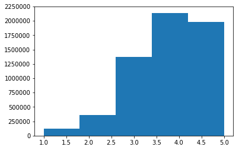
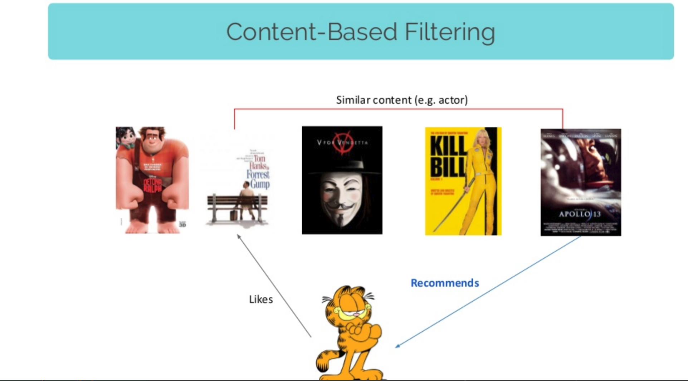

# Building a recommender system

Agenda:
        * What is a recommender system?
        * Defining a metrics system 
        [3 possible approaches]
        * The popularity model
        * Content based filtering
        * Collaborative filtering

## The problem


Some examples of where you might find / use  a recommendation engine? 

### Global examples

    * Predicting next cities to visit ( booking.com )
    * Predicting next meetups to attend ( meetup.com )
    * Predicting people to befriend ( facebook.com )
    * Predicting what adds to show you ( google.com )
    etc..

### Local examples

    * Predicting future products to buy ( emag ;) )
    * Predict next meals to have ( hipmenu ;) )
    * Predicting next teams to follow ( betfair ;) )
    etc..

### Our data and use case

Let's just say that I know many people from Amazon :D

We will be using a [book dataset](https://github.com/zygmuntz/goodbooks-10k) found here. It contains 10k books and 6 mil reviews (scores 1, 5).

Our task is to take those ratings and suggest for each user `new` things to read based on his previous feedback.


*Formally*


Given 
    * a set of users [U1, U2, ...]
    * a set of possible elements [E1, E2, ... ] 
    * some prior interactions (relation) between Us and Es ( {seen, clicked, subscribed, bought} or a rating, or a feedback, etc..), 
    
for a given user U, predict a list of top N elements from E such as U maximizes the defined relation.


As I've said, usually the relation is an something numeric, business defined ( amount of money, click-through-rates, churn, etc..)

## Loading the data


```python
import pandas as pd
```


```python
books = pd.read_csv("./Building a recommender system/books.csv")
ratings = pd.read_csv("./Building a recommender system/ratings.csv")
tags = pd.read_csv("./Building a recommender system/tags.csv")
tags = tags.set_index('tag_id')

book_tags = pd.read_csv("./Building a recommender system/book_tags.csv")
```

# Data exploration

This wrapped function tells the pandas library to display all the fields


```python
def display_all(df):
    with pd.option_context("display.max_rows", 1000, "display.max_columns", 1000): 
        display(df)
```

Books are sorted by their popularity, as measured by number of ratings


```python
display_all(books.head().T)
```


<div>
<style scoped>
    .dataframe tbody tr th:only-of-type {
        vertical-align: middle;
    }

    .dataframe tbody tr th {
        vertical-align: top;
    }

    .dataframe thead th {
        text-align: right;
    }
</style>
<table border="1" class="dataframe">
  <thead>
    <tr style="text-align: right;">
      <th></th>
      <th>0</th>
      <th>1</th>
      <th>2</th>
      <th>3</th>
      <th>4</th>
    </tr>
  </thead>
  <tbody>
    <tr>
      <th>book_id</th>
      <td>1</td>
      <td>2</td>
      <td>3</td>
      <td>4</td>
      <td>5</td>
    </tr>
    <tr>
      <th>goodreads_book_id</th>
      <td>2767052</td>
      <td>3</td>
      <td>41865</td>
      <td>2657</td>
      <td>4671</td>
    </tr>
    <tr>
      <th>best_book_id</th>
      <td>2767052</td>
      <td>3</td>
      <td>41865</td>
      <td>2657</td>
      <td>4671</td>
    </tr>
    <tr>
      <th>work_id</th>
      <td>2792775</td>
      <td>4640799</td>
      <td>3212258</td>
      <td>3275794</td>
      <td>245494</td>
    </tr>
    <tr>
      <th>books_count</th>
      <td>272</td>
      <td>491</td>
      <td>226</td>
      <td>487</td>
      <td>1356</td>
    </tr>
    <tr>
      <th>isbn</th>
      <td>439023483</td>
      <td>439554934</td>
      <td>316015849</td>
      <td>61120081</td>
      <td>743273567</td>
    </tr>
    <tr>
      <th>isbn13</th>
      <td>9.78044e+12</td>
      <td>9.78044e+12</td>
      <td>9.78032e+12</td>
      <td>9.78006e+12</td>
      <td>9.78074e+12</td>
    </tr>
    <tr>
      <th>authors</th>
      <td>Suzanne Collins</td>
      <td>J.K. Rowling, Mary GrandPré</td>
      <td>Stephenie Meyer</td>
      <td>Harper Lee</td>
      <td>F. Scott Fitzgerald</td>
    </tr>
    <tr>
      <th>original_publication_year</th>
      <td>2008</td>
      <td>1997</td>
      <td>2005</td>
      <td>1960</td>
      <td>1925</td>
    </tr>
    <tr>
      <th>original_title</th>
      <td>The Hunger Games</td>
      <td>Harry Potter and the Philosopher's Stone</td>
      <td>Twilight</td>
      <td>To Kill a Mockingbird</td>
      <td>The Great Gatsby</td>
    </tr>
    <tr>
      <th>title</th>
      <td>The Hunger Games (The Hunger Games, #1)</td>
      <td>Harry Potter and the Sorcerer's Stone (Harry P...</td>
      <td>Twilight (Twilight, #1)</td>
      <td>To Kill a Mockingbird</td>
      <td>The Great Gatsby</td>
    </tr>
    <tr>
      <th>language_code</th>
      <td>eng</td>
      <td>eng</td>
      <td>en-US</td>
      <td>eng</td>
      <td>eng</td>
    </tr>
    <tr>
      <th>average_rating</th>
      <td>4.34</td>
      <td>4.44</td>
      <td>3.57</td>
      <td>4.25</td>
      <td>3.89</td>
    </tr>
    <tr>
      <th>ratings_count</th>
      <td>4780653</td>
      <td>4602479</td>
      <td>3866839</td>
      <td>3198671</td>
      <td>2683664</td>
    </tr>
    <tr>
      <th>work_ratings_count</th>
      <td>4942365</td>
      <td>4800065</td>
      <td>3916824</td>
      <td>3340896</td>
      <td>2773745</td>
    </tr>
    <tr>
      <th>work_text_reviews_count</th>
      <td>155254</td>
      <td>75867</td>
      <td>95009</td>
      <td>72586</td>
      <td>51992</td>
    </tr>
    <tr>
      <th>ratings_1</th>
      <td>66715</td>
      <td>75504</td>
      <td>456191</td>
      <td>60427</td>
      <td>86236</td>
    </tr>
    <tr>
      <th>ratings_2</th>
      <td>127936</td>
      <td>101676</td>
      <td>436802</td>
      <td>117415</td>
      <td>197621</td>
    </tr>
    <tr>
      <th>ratings_3</th>
      <td>560092</td>
      <td>455024</td>
      <td>793319</td>
      <td>446835</td>
      <td>606158</td>
    </tr>
    <tr>
      <th>ratings_4</th>
      <td>1481305</td>
      <td>1156318</td>
      <td>875073</td>
      <td>1001952</td>
      <td>936012</td>
    </tr>
    <tr>
      <th>ratings_5</th>
      <td>2706317</td>
      <td>3011543</td>
      <td>1355439</td>
      <td>1714267</td>
      <td>947718</td>
    </tr>
    <tr>
      <th>image_url</th>
      <td>https://images.gr-assets.com/books/1447303603m...</td>
      <td>https://images.gr-assets.com/books/1474154022m...</td>
      <td>https://images.gr-assets.com/books/1361039443m...</td>
      <td>https://images.gr-assets.com/books/1361975680m...</td>
      <td>https://images.gr-assets.com/books/1490528560m...</td>
    </tr>
    <tr>
      <th>small_image_url</th>
      <td>https://images.gr-assets.com/books/1447303603s...</td>
      <td>https://images.gr-assets.com/books/1474154022s...</td>
      <td>https://images.gr-assets.com/books/1361039443s...</td>
      <td>https://images.gr-assets.com/books/1361975680s...</td>
      <td>https://images.gr-assets.com/books/1490528560s...</td>
    </tr>
  </tbody>
</table>
</div>


We have 10k books


```python
len(books)
```


    10000


Ratings are sorted chronologically, oldest first.


```python
display_all(ratings.head())
```


<div>
<style scoped>
    .dataframe tbody tr th:only-of-type {
        vertical-align: middle;
    }

    .dataframe tbody tr th {
        vertical-align: top;
    }

    .dataframe thead th {
        text-align: right;
    }
</style>
<table border="1" class="dataframe">
  <thead>
    <tr style="text-align: right;">
      <th></th>
      <th>user_id</th>
      <th>book_id</th>
      <th>rating</th>
    </tr>
  </thead>
  <tbody>
    <tr>
      <th>0</th>
      <td>1</td>
      <td>258</td>
      <td>5</td>
    </tr>
    <tr>
      <th>1</th>
      <td>2</td>
      <td>4081</td>
      <td>4</td>
    </tr>
    <tr>
      <th>2</th>
      <td>2</td>
      <td>260</td>
      <td>5</td>
    </tr>
    <tr>
      <th>3</th>
      <td>2</td>
      <td>9296</td>
      <td>5</td>
    </tr>
    <tr>
      <th>4</th>
      <td>2</td>
      <td>2318</td>
      <td>3</td>
    </tr>
  </tbody>
</table>
</div>


```python
ratings.rating.min(), ratings.rating.max()
```


    (1, 5)


```python
ratings.rating.hist( bins = 5, grid=False)
```





It appears that 4 is the most popular rating. There are relatively few ones and twos.


```python
len(ratings)
```


    5976479


Most books have a few hundred reviews, but some have as few as eight.


```python
reviews_per_book = ratings.groupby( 'book_id' ).book_id.apply( lambda x: len( x ))
reviews_per_book.to_frame().describe()
```


<div>
<style scoped>
    .dataframe tbody tr th:only-of-type {
        vertical-align: middle;
    }

    .dataframe tbody tr th {
        vertical-align: top;
    }

    .dataframe thead th {
        text-align: right;
    }
</style>
<table border="1" class="dataframe">
  <thead>
    <tr style="text-align: right;">
      <th></th>
      <th>book_id</th>
    </tr>
  </thead>
  <tbody>
    <tr>
      <th>count</th>
      <td>10000.000000</td>
    </tr>
    <tr>
      <th>mean</th>
      <td>597.647900</td>
    </tr>
    <tr>
      <th>std</th>
      <td>1267.289788</td>
    </tr>
    <tr>
      <th>min</th>
      <td>8.000000</td>
    </tr>
    <tr>
      <th>25%</th>
      <td>155.000000</td>
    </tr>
    <tr>
      <th>50%</th>
      <td>248.000000</td>
    </tr>
    <tr>
      <th>75%</th>
      <td>503.000000</td>
    </tr>
    <tr>
      <th>max</th>
      <td>22806.000000</td>
    </tr>
  </tbody>
</table>
</div>


# Train test split

Of course we need to first follow the best practices and split the data into training and testing sets. 


```python
from sklearn.model_selection import train_test_split

train_df, test_df = train_test_split(ratings,
                                   stratify=ratings['user_id'], 
                                   test_size=0.20,
)
len(train_df), len(test_df)
```


    (4781183, 1195296)


# Evaluation metrics

Let's think a bit about how would we measure a recommendation engine..

Any ideas?

*If you say either of {precision, recall, f-score, accuracy} you're wrong*

## Top-N accuracy metrics

... are a class of metrics that are called [*Top-N accuracy* metrics](http://fastml.com/evaluating-recommender-systems/), which evaluate the accuracy of the top recommendations provided to a user, comparing to the items the user has actually interacted in test set.

* Recall@N 
    * given a list [n, n, n, p, n, n, ...] 
    * N the top most important results, how often does p is among the returned N values
    * Has variants Recall@5, Recall@10, etc..
   
* NDCG@N ([Normalized Discounted Cumulative Gain](https://en.wikipedia.org/wiki/Discounted_cumulative_gain) @ N)
    * A recommender returns some items and we’d like to compute how good the list is. Each item has a relevance score, usually a non-negative number. That’s **gain**.
    * Now we add up those scores; that’s **cumulative gain**.
    * We’d prefer to see the most relevant items at the top of the list, therefore before summing the scores we divide each by a growing number (usually a logarithm of the item position) - that’s **discounting**
    * DCGs are not directly comparable between users, so we **normalize** them. 
    
* MAP@N (Mean Average Precision)


# Popularity model

A common baseline approach is the Popularity model. 


This model is not actually personalized - it simply recommends to a user the most popular items that the user has not previously consumed. 


As the popularity accounts for the "wisdom of the crowds", it usually provides good recommendations, generally interesting for most people.


```python
book_ratings = ratings.groupby('book_id').size().reset_index(name='users')
book_popularity = ratings.groupby('book_id')['rating'].sum().sort_values(ascending=False).reset_index()
book_popularity = pd.merge(book_popularity, book_ratings, how='inner', on=['book_id'])
book_popularity = pd.merge(book_popularity, books[['book_id', 'title', 'authors']], how='inner', on=['book_id'])
book_popularity = book_popularity.sort_values(by=['rating'], ascending=False)
book_popularity.head()
```


<div>
<style scoped>
    .dataframe tbody tr th:only-of-type {
        vertical-align: middle;
    }

    .dataframe tbody tr th {
        vertical-align: top;
    }

    .dataframe thead th {
        text-align: right;
    }
</style>
<table border="1" class="dataframe">
  <thead>
    <tr style="text-align: right;">
      <th></th>
      <th>book_id</th>
      <th>rating</th>
      <th>users</th>
      <th>title</th>
      <th>authors</th>
    </tr>
  </thead>
  <tbody>
    <tr>
      <th>0</th>
      <td>1</td>
      <td>97603</td>
      <td>22806</td>
      <td>The Hunger Games (The Hunger Games, #1)</td>
      <td>Suzanne Collins</td>
    </tr>
    <tr>
      <th>1</th>
      <td>2</td>
      <td>95077</td>
      <td>21850</td>
      <td>Harry Potter and the Sorcerer's Stone (Harry P...</td>
      <td>J.K. Rowling, Mary GrandPré</td>
    </tr>
    <tr>
      <th>2</th>
      <td>4</td>
      <td>82639</td>
      <td>19088</td>
      <td>To Kill a Mockingbird</td>
      <td>Harper Lee</td>
    </tr>
    <tr>
      <th>3</th>
      <td>18</td>
      <td>70059</td>
      <td>15855</td>
      <td>Harry Potter and the Prisoner of Azkaban (Harr...</td>
      <td>J.K. Rowling, Mary GrandPré, Rufus Beck</td>
    </tr>
    <tr>
      <th>4</th>
      <td>25</td>
      <td>69265</td>
      <td>15304</td>
      <td>Harry Potter and the Deathly Hallows (Harry Po...</td>
      <td>J.K. Rowling, Mary GrandPré</td>
    </tr>
  </tbody>
</table>
</div>


Unfortunately, this strategy depends on what we rank on....

Let's imagine we have another way to rank this list. (Above, books are sorted by their popularity, as measured by number of ratings.)

Let's imagine we want to sort books by their average rating ( i.e. `sum(ratings) / len(ratings)`)


```python
book_popularity.rating = book_popularity.rating / book_popularity.users
book_popularity = book_popularity.sort_values(by=['rating'], ascending=False)

book_popularity.head(n=20)
```


<div>
<style scoped>
    .dataframe tbody tr th:only-of-type {
        vertical-align: middle;
    }

    .dataframe tbody tr th {
        vertical-align: top;
    }

    .dataframe thead th {
        text-align: right;
    }
</style>
<table border="1" class="dataframe">
  <thead>
    <tr style="text-align: right;">
      <th></th>
      <th>book_id</th>
      <th>rating</th>
      <th>users</th>
      <th>title</th>
      <th>authors</th>
    </tr>
  </thead>
  <tbody>
    <tr>
      <th>2108</th>
      <td>3628</td>
      <td>4.829876</td>
      <td>482</td>
      <td>The Complete Calvin and Hobbes</td>
      <td>Bill Watterson</td>
    </tr>
    <tr>
      <th>9206</th>
      <td>7947</td>
      <td>4.818182</td>
      <td>88</td>
      <td>ESV Study Bible</td>
      <td>Anonymous, Lane T. Dennis, Wayne A. Grudem</td>
    </tr>
    <tr>
      <th>6648</th>
      <td>9566</td>
      <td>4.768707</td>
      <td>147</td>
      <td>Attack of the Deranged Mutant Killer Monster S...</td>
      <td>Bill Watterson</td>
    </tr>
    <tr>
      <th>4766</th>
      <td>6920</td>
      <td>4.766355</td>
      <td>214</td>
      <td>The Indispensable Calvin and Hobbes</td>
      <td>Bill Watterson</td>
    </tr>
    <tr>
      <th>5702</th>
      <td>8978</td>
      <td>4.761364</td>
      <td>176</td>
      <td>The Revenge of the Baby-Sat</td>
      <td>Bill Watterson</td>
    </tr>
    <tr>
      <th>3904</th>
      <td>6361</td>
      <td>4.760456</td>
      <td>263</td>
      <td>There's Treasure Everywhere: A Calvin and Hobb...</td>
      <td>Bill Watterson</td>
    </tr>
    <tr>
      <th>4228</th>
      <td>6590</td>
      <td>4.757202</td>
      <td>243</td>
      <td>The Authoritative Calvin and Hobbes: A Calvin ...</td>
      <td>Bill Watterson</td>
    </tr>
    <tr>
      <th>2695</th>
      <td>4483</td>
      <td>4.747396</td>
      <td>384</td>
      <td>It's a Magical World: A Calvin and Hobbes Coll...</td>
      <td>Bill Watterson</td>
    </tr>
    <tr>
      <th>3627</th>
      <td>3275</td>
      <td>4.736842</td>
      <td>285</td>
      <td>Harry Potter Boxed Set, Books 1-5 (Harry Potte...</td>
      <td>J.K. Rowling, Mary GrandPré</td>
    </tr>
    <tr>
      <th>1579</th>
      <td>1788</td>
      <td>4.728528</td>
      <td>652</td>
      <td>The Calvin and Hobbes Tenth Anniversary Book</td>
      <td>Bill Watterson</td>
    </tr>
    <tr>
      <th>4047</th>
      <td>5207</td>
      <td>4.722656</td>
      <td>256</td>
      <td>The Days Are Just Packed: A Calvin and Hobbes ...</td>
      <td>Bill Watterson</td>
    </tr>
    <tr>
      <th>9659</th>
      <td>8946</td>
      <td>4.720000</td>
      <td>75</td>
      <td>The Divan</td>
      <td>Hafez</td>
    </tr>
    <tr>
      <th>1067</th>
      <td>1308</td>
      <td>4.718114</td>
      <td>933</td>
      <td>A Court of Mist and Fury (A Court of Thorns an...</td>
      <td>Sarah J. Maas</td>
    </tr>
    <tr>
      <th>5938</th>
      <td>9141</td>
      <td>4.711765</td>
      <td>170</td>
      <td>The Way of Kings, Part 1 (The Stormlight Archi...</td>
      <td>Brandon Sanderson</td>
    </tr>
    <tr>
      <th>681</th>
      <td>862</td>
      <td>4.702840</td>
      <td>1373</td>
      <td>Words of Radiance (The Stormlight Archive, #2)</td>
      <td>Brandon Sanderson</td>
    </tr>
    <tr>
      <th>4445</th>
      <td>3753</td>
      <td>4.699571</td>
      <td>233</td>
      <td>Harry Potter Collection (Harry Potter, #1-6)</td>
      <td>J.K. Rowling</td>
    </tr>
    <tr>
      <th>3900</th>
      <td>5580</td>
      <td>4.689139</td>
      <td>267</td>
      <td>The Calvin and Hobbes Lazy Sunday Book</td>
      <td>Bill Watterson</td>
    </tr>
    <tr>
      <th>6968</th>
      <td>8663</td>
      <td>4.680851</td>
      <td>141</td>
      <td>Locke &amp; Key, Vol. 6: Alpha &amp; Omega</td>
      <td>Joe Hill, Gabriel Rodríguez</td>
    </tr>
    <tr>
      <th>5603</th>
      <td>8109</td>
      <td>4.677596</td>
      <td>183</td>
      <td>The Absolute Sandman, Volume One</td>
      <td>Neil Gaiman, Mike Dringenberg, Chris Bachalo, ...</td>
    </tr>
    <tr>
      <th>7743</th>
      <td>8569</td>
      <td>4.669355</td>
      <td>124</td>
      <td>Styxx (Dark-Hunter, #22)</td>
      <td>Sherrilyn Kenyon</td>
    </tr>
  </tbody>
</table>
</div>


?! Maybe this Bill Watterson pays people for good reviews..


This of course is insufficient advice for good books. Title fanatics may give high scores for unknown books. Since they are the only ones that do reviews, the books generally get good scores.

# Content based filtering



[Reference for slide](https://www.slideshare.net/gabrielspmoreira/discovering-users-topics-of-interest-in-recommender-systems-tdc-sp-2016)

The aim of this approach is to group similar object together and recommend new objects from the same categories that the user already purchased

We already have tags for books in this dataset, let's use them!


```python
book_tags.head()
```


<div>
<style scoped>
    .dataframe tbody tr th:only-of-type {
        vertical-align: middle;
    }

    .dataframe tbody tr th {
        vertical-align: top;
    }

    .dataframe thead th {
        text-align: right;
    }
</style>
<table border="1" class="dataframe">
  <thead>
    <tr style="text-align: right;">
      <th></th>
      <th>goodreads_book_id</th>
      <th>tag_id</th>
      <th>count</th>
    </tr>
  </thead>
  <tbody>
    <tr>
      <th>0</th>
      <td>1</td>
      <td>30574</td>
      <td>167697</td>
    </tr>
    <tr>
      <th>1</th>
      <td>1</td>
      <td>11305</td>
      <td>37174</td>
    </tr>
    <tr>
      <th>2</th>
      <td>1</td>
      <td>11557</td>
      <td>34173</td>
    </tr>
    <tr>
      <th>3</th>
      <td>1</td>
      <td>8717</td>
      <td>12986</td>
    </tr>
    <tr>
      <th>4</th>
      <td>1</td>
      <td>33114</td>
      <td>12716</td>
    </tr>
  </tbody>
</table>
</div>


```python
def get_tag_name(tag_id):
    return {word for word in tags.loc[tag_id].tag_name.split('-') if word}

get_tag_name(20000)
```


    {'in', 'midnight', 'paris'}


We're going to accumulate all the tags of a book in a single datastructure


```python
from tqdm import tqdm_notebook as tqdm
book_tags_dict = dict()
for book_id, tag_id, _ in tqdm(book_tags.values):
    tags_of_book = book_tags_dict.setdefault(book_id, set()) 
    tags_of_book |= get_tag_name(tag_id)
```


Let's see the tags for one book


```python
" ".join(book_tags_dict[105])
```


    'up read literature reading ficción place i time speculative audible favorites ebooks adult 20th ciencia book chronicles owned sciencefiction audio general kindle opera gave sci bought fiction currently imaginary stories not future books herbert short fantascienza favourites sf space scifi paperback it bookshelf religion get buy re default fantasy 1980s series ficcion audiobook frank novels century fi my adventure philosophy classic home to dune and calibre in e novel on science classics american ebook shelfari unread politics f finished epic scanned s all audiobooks english own library sff'


And the book is...


```python
books.loc[books.goodreads_book_id == 105][['book_id', 'title', 'authors']]
```


<div>
<style scoped>
    .dataframe tbody tr th:only-of-type {
        vertical-align: middle;
    }

    .dataframe tbody tr th {
        vertical-align: top;
    }

    .dataframe thead th {
        text-align: right;
    }
</style>
<table border="1" class="dataframe">
  <thead>
    <tr style="text-align: right;">
      <th></th>
      <th>book_id</th>
      <th>title</th>
      <th>authors</th>
    </tr>
  </thead>
  <tbody>
    <tr>
      <th>2816</th>
      <td>2817</td>
      <td>Chapterhouse: Dune (Dune Chronicles #6)</td>
      <td>Frank Herbert</td>
    </tr>
  </tbody>
</table>
</div>


There are two types of ids in this dataset: `goodreads_book_id` and `book_id` we will make two `dict`s to switch from one to the other


```python
goodread2id = {goodreads_book_id: book_id for book_id, goodreads_book_id in books[['book_id', 'goodreads_book_id']].values}
id2goodread = dict(zip(goodread2id.values(), goodread2id.keys()))

id2goodread[2817], goodread2id[105]
```


    (105, 2817)


Then we're going to do convert the tags into a numpy plain array that we aim to process later. The row position of a tag should match the book_id. Because these start from 1, we will add a DUMMY padding element.


```python
import numpy as np
np_tags = np.array(sorted([[0, "DUMMY"]] + [[goodread2id[id], " ".join(tags)] for id, tags in book_tags_dict.items()]))
np_tags[:5]
```


    array([['0', 'DUMMY'],
           ['1',
            'read age reading i time speculative 2014 the favorites loved adult ebooks than of book owned 5 audio thriller kindle suzanne club faves favourite teen sci love currently fiction dystopian stars drama suspense action reviewed dystopia future 2011 young books ya futuristic favourites sf post 2013 borrowed trilogy scifi it games once buy distopian re default fantasy series distopia triangle audiobook novels 2010 fi my adventure romance favs contemporary lit to reads 2012 in e novel dystopias science favorite ebook shelfari finished star collins reread hunger more survival all audiobooks english apocalyptic completed coming own library'],
           ['2',
            'read 2016 literature reading own 2015 i time 2014 favorites 2017 jk adult than childhood owned 5 audio england kindle faves favourite teen sci kids j currently fiction mystery friendship stars youth childrens young books ya k potter favourites 2013 urban scifi it bookshelf once buy re default fantasy series audiobook novels fi my grade adventure wizards shelf favs contemporary witches classic to reads children harry in rereads on novel science classics rowling favorite juvenile british ebook shelfari magic middle reread more s supernatural paranormal all audiobooks english lit library'],
           ['3',
            'read stephenie reading finish i time high favorites 2008 adult than meh book owned 5 werewolves meyer kindle pleasures club faves teen sci guilty love fiction currently not stars drama stephanie young books ya already favourites urban scifi it bookshelf horror once re default fantasy saga series triangle audiobook novels youngadult fi my movie vampires séries romance shelf contemporary lit to vampire chick again did in on twilight movies science favorite pleasure american adults 2009 ebook dnf shelfari vamps never finished school abandoned more reread supernatural pnr first paranormal all audiobooks english romantic completed have own library'],
           ['4',
            'crime read 2016 age lee literature reading own 2015 i time required historical 1001 the 2014 high history favorites prize family adult 20th racism you of book bookclub childhood before list owned 5 audio general kindle wish club banned faves usa favourite fiction currently mystery challenge stars drama young books ya favourites modern it buy re default race for audiobook die novels century harper my contemporary classic to reads pulitzer clàssics southern again in novel gilmore classics american favorite literary ebook shelfari realistic school rory reread must all audiobooks english coming lit library']],
          dtype='<U970')


Next up we want to process the tags but if you look closely there are many words that have the same meaning but are slighly different (because of the context in which they are used).

We'd like to `normalize` them as much as possible so as to keep the overall vocabulary small.

This process can be accomplished through `stemming` and `lemmatization`. Let me show you an example:


```python
stemmer = PorterStemmer()
stemmer.stem('autobiographical')
```


    'autobiograph'


Lemmatisation is the process of grouping together the inflected forms of a word so they can be analysed as a single item, identified by the word's lemma, or dictionary form.


Stamming, is the process of reducing inflected words to their word stem, base or root form—generally a written word form.


```python
from nltk import word_tokenize          
from nltk.stem import WordNetLemmatizer, PorterStemmer
class LemmaTokenizer(object):
    def __init__(self):
        self.wnl = WordNetLemmatizer()
        self.stm = PorterStemmer()
    def __call__(self, doc):
        return [self.stm.stem(self.wnl.lemmatize(t)) for t in word_tokenize(doc)]
```

After this we're ready to process the data. 

We will build a `sklearn` pipeline to process the tags. 

We will first be using a tf-idf metric customized to tokenize words with the above implemented Lemmer and Stemmer class. Then we will use a StandardScaler transform to 
make all the values in the resulting matrix [0, 1] bound.


```python
from sklearn.pipeline import Pipeline
from sklearn.feature_extraction.text import TfidfVectorizer
from sklearn.preprocessing import StandardScaler

p = Pipeline([
    ('vectorizer', TfidfVectorizer(
        tokenizer=LemmaTokenizer(),
        strip_accents='unicode',
        ngram_range=(1, 1),
        max_features=1000,
        min_df=0.005,
        max_df=0.5,
    )),
    ('normalizer', StandardScaler(with_mean=False))
])
trans = p.fit_transform(np_tags[:,1])
```


```python
trans.shape
```


    (10001, 1000)


After this point, the `trans` variable contains a row for each book, each suck row 
corresponds to a 1000 dimensional array.  Each element of that 1000, is a score for the most `important` 1000 words that the TfidfVectorizer decided to keep (1000 words chosen from all the book tags provided). 

This is the vectorized representation of the book, the vector the contains (many 0 values) the most important (cumulated for all users) words with which people tagged the books.

Next up, let's see how many users do we have and let's extract them into a single list.


```python
users = ratings.set_index('user_id').index.unique().values
len(users)
```


    53424


That's how we get all the book ratings of a single user


```python
ratings.loc[ratings.user_id == users[0]][['book_id', 'rating']].head()
```


<div>
<style scoped>
    .dataframe tbody tr th:only-of-type {
        vertical-align: middle;
    }

    .dataframe tbody tr th {
        vertical-align: top;
    }

    .dataframe thead th {
        text-align: right;
    }
</style>
<table border="1" class="dataframe">
  <thead>
    <tr style="text-align: right;">
      <th></th>
      <th>book_id</th>
      <th>rating</th>
    </tr>
  </thead>
  <tbody>
    <tr>
      <th>0</th>
      <td>258</td>
      <td>5</td>
    </tr>
    <tr>
      <th>75</th>
      <td>268</td>
      <td>3</td>
    </tr>
    <tr>
      <th>76</th>
      <td>5556</td>
      <td>3</td>
    </tr>
    <tr>
      <th>77</th>
      <td>3638</td>
      <td>3</td>
    </tr>
    <tr>
      <th>78</th>
      <td>1796</td>
      <td>5</td>
    </tr>
  </tbody>
</table>
</div>


We'll actually write a function for this because it's rather obscure. We want all the book_ids that the user rated, along with the given rating for each book.


```python
def books_and_ratings(user_id):
        books_and_ratings_df = ratings.loc[ratings.user_id == user_id][['book_id', 'rating']]
        u_books, u_ratings = zip(*books_and_ratings_df.values)
        return np.array(u_books), np.array(u_ratings)
    
u_books, u_ratings = books_and_ratings(users[0])
u_books.shape, trans[u_books].shape
```


    ((117,), (117, 1000))


We then multiply the book's ratings with the features of the book, to boost the features importance for this user, then add everything together into a single `user specific` feature vector.


```python
user_vector = (u_ratings * trans[u_books]) / len(u_ratings)
user_vector.shape
```


    (1000,)


If we get all the features of a book, scale each book by the user's ratings and then do a mean on all the scaled book features as above, we actually obtain a condensed form of that user's preferences. 

So doing the above we just obtained a `user_vector`, a 1000 dimensional vector that expresses what the user likes, by combining his prior ratings on the books he read with the respected `book_vectors`.


```python
def get_user_vector(user_id):
    u_books, u_ratings = books_and_ratings(user_id)
    u_books_features = trans[u_books]
    u_vector = (u_ratings * u_books_features) / len(u_ratings)
    return u_vector
    
def get_user_vectors():
    user_vectors = np.zeros((len(users), 1000))
    for user_id in tqdm(users[:1000]):
        u_vector = get_user_vector(user_id)
        user_vectors[user_id, :] = u_vector
    return user_vectors

user_vectors = get_user_vectors()
```


    HBox(children=(IntProgress(value=0, max=1000), HTML(value='')))


The pipeline transformation also keeps the most important 1000 words. Let's see a sample of them now..


```python
trans_feature_names = p.named_steps['vectorizer'].get_feature_names()
np.random.permutation(np.array(trans_feature_names))[:100]
```


    array(['guilti', 'america', 'roman', 'witch', '1970', 'scott', 'hous',
           'occult', 'michael', 'winner', 'nonfic', 'improv', 'australia',
           'pre', 'britain', 'london', 'tear', 'comicbook', 'steami', 'arab',
           'young', 'alex', 'literatura', 'man', 'altern', 's', 'sport',
           'warfar', 'california', 'americana', 'keeper', '311', 'era',
           'life', 'heroin', 'urban', 'sexi', '18th', 'were', 'black',
           'super', 'goodread', 'nativ', 'روايات', 'novella', 'great',
           'youth', 'pleasur', 'mayb', 'canadiana', 'childhood', 'realli',
           'be', 'home', 'pictur', 'for', 'all', 'guardian', 'race',
           'investig', 'earli', 'easi', 'latin', '314', 'long', 'seen', '20',
           'polit', 'group', 'fave', 'abus', 'lendabl', 'clasico', 'essay',
           'punk', 'town', 'biblic', 'mental', 'oprah', 'fantasia', 'tween',
           'dean', 'asia', 'jane', 'epub', 'hilari', 'as', 'singl', '33',
           'new', 'ministri', 'psycholog', 'sweet', 'jennif', 'orphan', '8th',
           'idea', 'neurosci', 'natur', 'boyfriend'], dtype='<U16')


Once we have the `user_vectors` computed, we want to show the most important 20 words for it.


```python
user_id = 801

pd.DataFrame(
    sorted(
        zip(
            trans_feature_names, 
            user_vectors[user_id].flatten().tolist()
        ), 
        key=lambda x: -x[1]
    )[:20],
    columns=['token', 'relevance']
).T
```


<div>
<style scoped>
    .dataframe tbody tr th:only-of-type {
        vertical-align: middle;
    }

    .dataframe tbody tr th {
        vertical-align: top;
    }

    .dataframe thead th {
        text-align: right;
    }
</style>
<table border="1" class="dataframe">
  <thead>
    <tr style="text-align: right;">
      <th></th>
      <th>0</th>
      <th>1</th>
      <th>2</th>
      <th>3</th>
      <th>4</th>
      <th>5</th>
      <th>6</th>
      <th>7</th>
      <th>8</th>
      <th>9</th>
      <th>10</th>
      <th>11</th>
      <th>12</th>
      <th>13</th>
      <th>14</th>
      <th>15</th>
      <th>16</th>
      <th>17</th>
      <th>18</th>
      <th>19</th>
    </tr>
  </thead>
  <tbody>
    <tr>
      <th>token</th>
      <td>club</td>
      <td>group</td>
      <td>bookclub</td>
      <td>literatur</td>
      <td>abandon</td>
      <td>literari</td>
      <td>gener</td>
      <td>t</td>
      <td>centuri</td>
      <td>didn</td>
      <td>memoir</td>
      <td>drama</td>
      <td>shelfari</td>
      <td>histori</td>
      <td>biographi</td>
      <td>recommend</td>
      <td>non</td>
      <td>did</td>
      <td>borrow</td>
      <td>not</td>
    </tr>
    <tr>
      <th>relevance</th>
      <td>6.32432</td>
      <td>6.20145</td>
      <td>5.94722</td>
      <td>5.46231</td>
      <td>5.01933</td>
      <td>4.88025</td>
      <td>4.53921</td>
      <td>4.39075</td>
      <td>4.36124</td>
      <td>4.25427</td>
      <td>4.21645</td>
      <td>4.1113</td>
      <td>4.10304</td>
      <td>4.07408</td>
      <td>4.07243</td>
      <td>3.99759</td>
      <td>3.99382</td>
      <td>3.89373</td>
      <td>3.82424</td>
      <td>3.80188</td>
    </tr>
  </tbody>
</table>
</div>


The last piece of the puzzle at this stage is making a link between the `book_vectors and` the `user_vectors`.

Since both of them are computed on the same feature space, we simply need a distance metric that would rank a given `user_vector` to all the `book_vectors`.

One such metric is the `cosine_similarity` that we're using bellow. It computes a distance between two n-dimensional vectors and returns a score between -1 and 1 where:
* something close to -1 means that the vectors have opposite relations (e.g. comedy and drama)
* something close to 0 means that the vectors have no relation between them
* something close to 1 means that the vectors are quite similar

The code bellow will compute a recommendation for a single user.


```python
from sklearn.metrics.pairwise import cosine_similarity

user_id = 100
cosine_similarities = cosine_similarity(np.expand_dims(user_vectors[user_id], 0), trans)
similar_indices = cosine_similarities.argsort().flatten()[-20:]
similar_indices
```


    array([ 194,  172, 7810, 3085,  213,  180,   35,  872, 3508, 5374, 8456,
            397, 3913, 1015, 8233,  162,  629, 2926, 4531,  323])


Which translates to the following books:


```python
books.loc[books.book_id.isin(similar_indices)][['title', 'authors']]
```


<div>
<style scoped>
    .dataframe tbody tr th:only-of-type {
        vertical-align: middle;
    }

    .dataframe tbody tr th {
        vertical-align: top;
    }

    .dataframe thead th {
        text-align: right;
    }
</style>
<table border="1" class="dataframe">
  <thead>
    <tr style="text-align: right;">
      <th></th>
      <th>title</th>
      <th>authors</th>
    </tr>
  </thead>
  <tbody>
    <tr>
      <th>34</th>
      <td>The Alchemist</td>
      <td>Paulo Coelho, Alan R. Clarke</td>
    </tr>
    <tr>
      <th>161</th>
      <td>The Stranger</td>
      <td>Albert Camus, Matthew    Ward</td>
    </tr>
    <tr>
      <th>171</th>
      <td>Anna Karenina</td>
      <td>Leo Tolstoy, Louise Maude, Leo Tolstoj, Aylmer...</td>
    </tr>
    <tr>
      <th>179</th>
      <td>Siddhartha</td>
      <td>Hermann Hesse, Hilda Rosner</td>
    </tr>
    <tr>
      <th>193</th>
      <td>Moby-Dick or, The Whale</td>
      <td>Herman Melville, Andrew Delbanco, Tom Quirk</td>
    </tr>
    <tr>
      <th>212</th>
      <td>The Metamorphosis</td>
      <td>Franz Kafka, Stanley Corngold</td>
    </tr>
    <tr>
      <th>322</th>
      <td>The Unbearable Lightness of Being</td>
      <td>Milan Kundera, Michael Henry Heim</td>
    </tr>
    <tr>
      <th>396</th>
      <td>Perfume: The Story of a Murderer</td>
      <td>Patrick Süskind, John E. Woods</td>
    </tr>
    <tr>
      <th>628</th>
      <td>Veronika Decides to Die</td>
      <td>Paulo Coelho, Margaret Jull Costa</td>
    </tr>
    <tr>
      <th>871</th>
      <td>The Plague</td>
      <td>Albert Camus, Stuart Gilbert</td>
    </tr>
    <tr>
      <th>1014</th>
      <td>Steppenwolf</td>
      <td>Hermann Hesse, Basil Creighton</td>
    </tr>
    <tr>
      <th>2925</th>
      <td>The Book of Laughter and Forgetting</td>
      <td>Milan Kundera, Aaron Asher</td>
    </tr>
    <tr>
      <th>3084</th>
      <td>Narcissus and Goldmund</td>
      <td>Hermann Hesse, Ursule Molinaro</td>
    </tr>
    <tr>
      <th>3507</th>
      <td>Swann's Way (In Search of Lost Time, #1)</td>
      <td>Marcel Proust, Simon Vance, Lydia Davis</td>
    </tr>
    <tr>
      <th>3912</th>
      <td>Immortality</td>
      <td>Milan Kundera</td>
    </tr>
    <tr>
      <th>4530</th>
      <td>The Joke</td>
      <td>Milan Kundera</td>
    </tr>
    <tr>
      <th>5373</th>
      <td>Laughable Loves</td>
      <td>Milan Kundera, Suzanne Rappaport</td>
    </tr>
    <tr>
      <th>7809</th>
      <td>Slowness</td>
      <td>Milan Kundera, Linda Asher</td>
    </tr>
    <tr>
      <th>8232</th>
      <td>The Book of Disquiet</td>
      <td>Fernando Pessoa, Richard Zenith</td>
    </tr>
    <tr>
      <th>8455</th>
      <td>Life is Elsewhere</td>
      <td>Milan Kundera, Aaron Asher</td>
    </tr>
  </tbody>
</table>
</div>


This approach gives way better predictions than the popularity model but, on the other hand, this relies on us having the content of the books (tags, book_tags, etc..) which we might not have, or might add a new level of complexity (parsing, cleaning, summarizing, etc...).

# Collaborative filtering


The idea of this approach is that users fall into `interest buckets`. 


If we are able so say that user `A` and user `B` fall in that same bucket (both may like history books), then whatever `A` liked, `B` might also like.


```python
books.head()
```


<div>
<style scoped>
    .dataframe tbody tr th:only-of-type {
        vertical-align: middle;
    }

    .dataframe tbody tr th {
        vertical-align: top;
    }

    .dataframe thead th {
        text-align: right;
    }
</style>
<table border="1" class="dataframe">
  <thead>
    <tr style="text-align: right;">
      <th></th>
      <th>book_id</th>
      <th>goodreads_book_id</th>
      <th>best_book_id</th>
      <th>work_id</th>
      <th>books_count</th>
      <th>isbn</th>
      <th>isbn13</th>
      <th>authors</th>
      <th>original_publication_year</th>
      <th>original_title</th>
      <th>...</th>
      <th>ratings_count</th>
      <th>work_ratings_count</th>
      <th>work_text_reviews_count</th>
      <th>ratings_1</th>
      <th>ratings_2</th>
      <th>ratings_3</th>
      <th>ratings_4</th>
      <th>ratings_5</th>
      <th>image_url</th>
      <th>small_image_url</th>
    </tr>
  </thead>
  <tbody>
    <tr>
      <th>0</th>
      <td>1</td>
      <td>2767052</td>
      <td>2767052</td>
      <td>2792775</td>
      <td>272</td>
      <td>439023483</td>
      <td>9.780439e+12</td>
      <td>Suzanne Collins</td>
      <td>2008.0</td>
      <td>The Hunger Games</td>
      <td>...</td>
      <td>4780653</td>
      <td>4942365</td>
      <td>155254</td>
      <td>66715</td>
      <td>127936</td>
      <td>560092</td>
      <td>1481305</td>
      <td>2706317</td>
      <td>https://images.gr-assets.com/books/1447303603m...</td>
      <td>https://images.gr-assets.com/books/1447303603s...</td>
    </tr>
    <tr>
      <th>1</th>
      <td>2</td>
      <td>3</td>
      <td>3</td>
      <td>4640799</td>
      <td>491</td>
      <td>439554934</td>
      <td>9.780440e+12</td>
      <td>J.K. Rowling, Mary GrandPré</td>
      <td>1997.0</td>
      <td>Harry Potter and the Philosopher's Stone</td>
      <td>...</td>
      <td>4602479</td>
      <td>4800065</td>
      <td>75867</td>
      <td>75504</td>
      <td>101676</td>
      <td>455024</td>
      <td>1156318</td>
      <td>3011543</td>
      <td>https://images.gr-assets.com/books/1474154022m...</td>
      <td>https://images.gr-assets.com/books/1474154022s...</td>
    </tr>
    <tr>
      <th>2</th>
      <td>3</td>
      <td>41865</td>
      <td>41865</td>
      <td>3212258</td>
      <td>226</td>
      <td>316015849</td>
      <td>9.780316e+12</td>
      <td>Stephenie Meyer</td>
      <td>2005.0</td>
      <td>Twilight</td>
      <td>...</td>
      <td>3866839</td>
      <td>3916824</td>
      <td>95009</td>
      <td>456191</td>
      <td>436802</td>
      <td>793319</td>
      <td>875073</td>
      <td>1355439</td>
      <td>https://images.gr-assets.com/books/1361039443m...</td>
      <td>https://images.gr-assets.com/books/1361039443s...</td>
    </tr>
    <tr>
      <th>3</th>
      <td>4</td>
      <td>2657</td>
      <td>2657</td>
      <td>3275794</td>
      <td>487</td>
      <td>61120081</td>
      <td>9.780061e+12</td>
      <td>Harper Lee</td>
      <td>1960.0</td>
      <td>To Kill a Mockingbird</td>
      <td>...</td>
      <td>3198671</td>
      <td>3340896</td>
      <td>72586</td>
      <td>60427</td>
      <td>117415</td>
      <td>446835</td>
      <td>1001952</td>
      <td>1714267</td>
      <td>https://images.gr-assets.com/books/1361975680m...</td>
      <td>https://images.gr-assets.com/books/1361975680s...</td>
    </tr>
    <tr>
      <th>4</th>
      <td>5</td>
      <td>4671</td>
      <td>4671</td>
      <td>245494</td>
      <td>1356</td>
      <td>743273567</td>
      <td>9.780743e+12</td>
      <td>F. Scott Fitzgerald</td>
      <td>1925.0</td>
      <td>The Great Gatsby</td>
      <td>...</td>
      <td>2683664</td>
      <td>2773745</td>
      <td>51992</td>
      <td>86236</td>
      <td>197621</td>
      <td>606158</td>
      <td>936012</td>
      <td>947718</td>
      <td>https://images.gr-assets.com/books/1490528560m...</td>
      <td>https://images.gr-assets.com/books/1490528560s...</td>
    </tr>
  </tbody>
</table>
<p>5 rows × 23 columns</p>
</div>


Our goal here is to express each user and each book into some `semantic` representation derived from the ratings we have.

We will model each id (both user_id, and book_id) as a `hidden` latent variable sequence (also called `embedding`). The user_id `embeddings` would represent that user's personal tastes. The book_id `embeddings` would represent the book characteristics. 

We then assume that the rating of a user would be the product between his personal tastes (the user's embeddings) multiplied with the books characteristics (the book embeddings).

Basically, this means we will try to model the formula

```
rating = user_preferences * book_charatersitcs + user_bias + book_bias
```

* `user_bias` is a tendency of a user to give higher or lower scores.
* `book_bias` is a tendency of a book to be more known, publicized, talked about so rated higher because of this.

We expect that while training, the ratings will back-propagate enough information into the embeddings so as to jointly decompose both the `user_preferences` vectors and `book_characteristics` vectors.


```python
from keras.layers import Input, Embedding, Flatten

from keras.layers import Input, InputLayer, Dense, Embedding, Flatten
from keras.layers.merge import dot, add
from keras.engine import Model
from keras.regularizers import l2
from keras.optimizers import Adam


hidden_factors = 10

user = Input(shape=(1,))
emb_u_w = Embedding(input_length=1, input_dim=len(users), output_dim=hidden_factors)
emb_u_b = Embedding(input_length=1, input_dim=len(users), output_dim=1)


book = Input(shape=(1,))
emb_b_w = Embedding(input_length=1, input_dim=len(books), output_dim=hidden_factors)
emb_b_b = Embedding(input_length=1, input_dim=len(books), output_dim=1)

merged = dot([
    Flatten()(emb_u_w(user)), 
    Flatten()(emb_b_w(book))
], axes=-1)
                   
merged = add([merged, Flatten()(emb_u_b(user))])
merged = add([merged, Flatten()(emb_b_b(book))])

model = Model(inputs=[user, book], outputs=merged)
model.summary()
model.compile(optimizer='adam', loss='mse')
model.optimizer.lr=0.001
```

    __________________________________________________________________________________________________
    Layer (type)                    Output Shape         Param #     Connected to                     
    ==================================================================================================
    input_32 (InputLayer)           (None, 1)            0                                            
    __________________________________________________________________________________________________
    input_33 (InputLayer)           (None, 1)            0                                            
    __________________________________________________________________________________________________
    embedding_62 (Embedding)        (None, 1, 10)        534240      input_32[0][0]                   
    __________________________________________________________________________________________________
    embedding_64 (Embedding)        (None, 1, 10)        100000      input_33[0][0]                   
    __________________________________________________________________________________________________
    flatten_60 (Flatten)            (None, 10)           0           embedding_62[0][0]               
    __________________________________________________________________________________________________
    flatten_61 (Flatten)            (None, 10)           0           embedding_64[0][0]               
    __________________________________________________________________________________________________
    embedding_63 (Embedding)        (None, 1, 1)         53424       input_32[0][0]                   
    __________________________________________________________________________________________________
    dot_9 (Dot)                     (None, 1)            0           flatten_60[0][0]                 
                                                                     flatten_61[0][0]                 
    __________________________________________________________________________________________________
    flatten_62 (Flatten)            (None, 1)            0           embedding_63[0][0]               
    __________________________________________________________________________________________________
    embedding_65 (Embedding)        (None, 1, 1)         10000       input_33[0][0]                   
    __________________________________________________________________________________________________
    add_15 (Add)                    (None, 1)            0           dot_9[0][0]                      
                                                                     flatten_62[0][0]                 
    __________________________________________________________________________________________________
    flatten_63 (Flatten)            (None, 1)            0           embedding_65[0][0]               
    __________________________________________________________________________________________________
    add_16 (Add)                    (None, 1)            0           add_15[0][0]                     
                                                                     flatten_63[0][0]                 
    ==================================================================================================
    Total params: 697,664
    Trainable params: 697,664
    Non-trainable params: 0
    __________________________________________________________________________________________________


```python
train_df.head()
```


<div>
<style scoped>
    .dataframe tbody tr th:only-of-type {
        vertical-align: middle;
    }

    .dataframe tbody tr th {
        vertical-align: top;
    }

    .dataframe thead th {
        text-align: right;
    }
</style>
<table border="1" class="dataframe">
  <thead>
    <tr style="text-align: right;">
      <th></th>
      <th>user_id</th>
      <th>book_id</th>
      <th>rating</th>
    </tr>
  </thead>
  <tbody>
    <tr>
      <th>2492982</th>
      <td>12364</td>
      <td>889</td>
      <td>4</td>
    </tr>
    <tr>
      <th>1374737</th>
      <td>5905</td>
      <td>930</td>
      <td>3</td>
    </tr>
    <tr>
      <th>4684686</th>
      <td>49783</td>
      <td>2398</td>
      <td>3</td>
    </tr>
    <tr>
      <th>5951422</th>
      <td>27563</td>
      <td>438</td>
      <td>4</td>
    </tr>
    <tr>
      <th>5588313</th>
      <td>44413</td>
      <td>4228</td>
      <td>4</td>
    </tr>
  </tbody>
</table>
</div>


```python
raw_data = train_df[['user_id', 'book_id', 'rating']].values
raw_valid = test_df[['user_id', 'book_id', 'rating']].values

u = raw_data[:,0] - 1
b = raw_data[:,1] - 1
r = raw_data[:,2]

vu = raw_data[:,0] - 1
vb = raw_data[:,1] - 1
vr = raw_data[:,2]


model.fit(x=[u, b], y=r, validation_data=([vu, vb], vr), epochs=1)
```

    Train on 100000 samples, validate on 30000 samples
    Epoch 1/1
    100000/100000 [==============================] - 36s 365us/step - loss: 8.6191 - val_loss: 7.1418


After the training is done, we can retrieve the embedding values for the books, the users and the biases in order to reproduce the computations ourselves for a single user.


```python
book_embeddings = emb_b_w.get_weights()[0]
book_embeddings.shape, "10000 books each with 10 hidden features (the embedding)"
```


    ((10000, 10), '10000 books each with 10 hidden features (the embedding)')


```python
user_embeddings = emb_u_w.get_weights()[0]
user_embeddings.shape, "54k users each with 10 hidden preferences"
```


    ((53424, 10), '54k users each with 10 hidden preferences')


```python
user_bias = emb_u_b.get_weights()[0]
book_bias = emb_b_b.get_weights()[0]
user_bias.shape, book_bias.shape, "every user and book has a specific bias"
```


    ((53424, 1), (10000, 1), 'every user and book has a specific bias')


Know, let's recompute the formula 

$$bookRating(b, u) = userEmbedding(u) * bookEmbedding(b) + bookBias(b) + userBias(u)$$ 

And do this for every book, if we have a specific user set.


```python
this_user = 220
books_ranked_for_user = (np.dot(book_embeddings, user_embeddings[this_user]) + user_bias[this_user] + book_bias.flatten())

books_ranked_for_user.shape
```


    (10000,)


We get back 10000 ratings, one for each book, scores computed specifically for this user's tastes.

We can now sort the ratings and get the 10 most "interesting" ones.


```python
best_book_ids = np.argsort(books_ranked_for_user)[-10:]
best_book_ids
```


    array([19, 17, 22, 23, 24, 16,  3, 26,  0,  1])


Which decode to...


```python
books.loc[books.book_id.isin(best_book_ids)][['title', 'authors']]
```


<div>
<style scoped>
    .dataframe tbody tr th:only-of-type {
        vertical-align: middle;
    }

    .dataframe tbody tr th {
        vertical-align: top;
    }

    .dataframe thead th {
        text-align: right;
    }
</style>
<table border="1" class="dataframe">
  <thead>
    <tr style="text-align: right;">
      <th></th>
      <th>title</th>
      <th>authors</th>
    </tr>
  </thead>
  <tbody>
    <tr>
      <th>0</th>
      <td>The Hunger Games (The Hunger Games, #1)</td>
      <td>Suzanne Collins</td>
    </tr>
    <tr>
      <th>2</th>
      <td>Twilight (Twilight, #1)</td>
      <td>Stephenie Meyer</td>
    </tr>
    <tr>
      <th>15</th>
      <td>The Girl with the Dragon Tattoo (Millennium, #1)</td>
      <td>Stieg Larsson, Reg Keeland</td>
    </tr>
    <tr>
      <th>16</th>
      <td>Catching Fire (The Hunger Games, #2)</td>
      <td>Suzanne Collins</td>
    </tr>
    <tr>
      <th>18</th>
      <td>The Fellowship of the Ring (The Lord of the Ri...</td>
      <td>J.R.R. Tolkien</td>
    </tr>
    <tr>
      <th>21</th>
      <td>The Lovely Bones</td>
      <td>Alice Sebold</td>
    </tr>
    <tr>
      <th>22</th>
      <td>Harry Potter and the Chamber of Secrets (Harry...</td>
      <td>J.K. Rowling, Mary GrandPré</td>
    </tr>
    <tr>
      <th>23</th>
      <td>Harry Potter and the Goblet of Fire (Harry Pot...</td>
      <td>J.K. Rowling, Mary GrandPré</td>
    </tr>
    <tr>
      <th>25</th>
      <td>The Da Vinci Code (Robert Langdon, #2)</td>
      <td>Dan Brown</td>
    </tr>
  </tbody>
</table>
</div>


Again you can imagine this being all this code tied up into a single system.

# Conclusions

* Recommender systems are (needed) everywhere
* The metrics used to evaluate one are more exotic (ex. NDCG@N, MAP@N, etc..)
* We've shown how to implement 3 recommendation engine models:
    * Popularity model
    * Content based model
    * Collaboration based model
    
* The collaboration based models have the lowest needs of data (information) among the three
